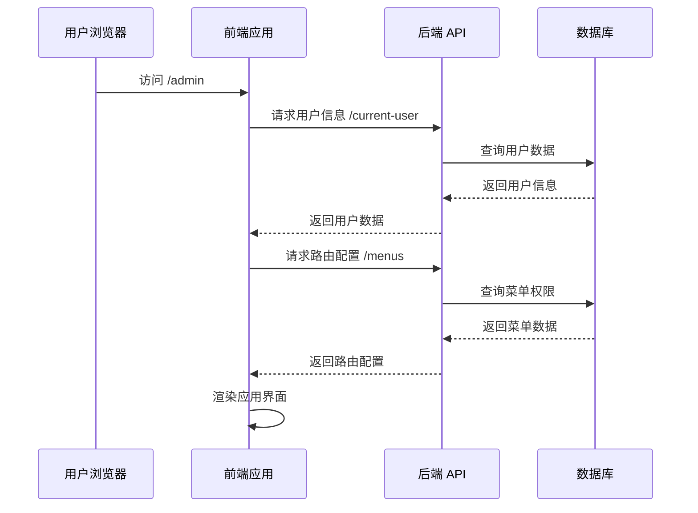
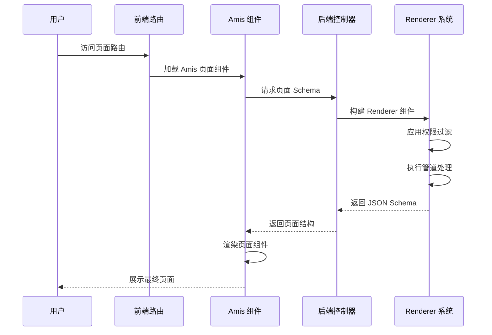
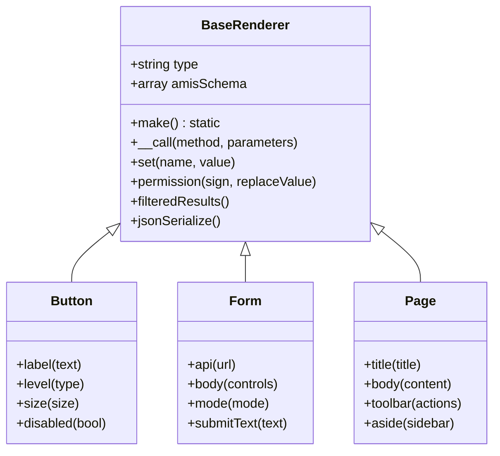

# 框架原理

Owl Admin 是一个基于 Laravel + React + Amis 的现代化管理后台框架。本文将深入解析框架的核心工作原理，帮助您更好地理解和使用框架。

## 整体架构

### 技术栈组成

**架构层次：**

```
┌─────────────────────────────────────────────────────────┐
│                   前端层 (React)                        │
├─────────────────────────────────────────────────────────┤
│                 Amis 渲染引擎                           │
├─────────────────────────────────────────────────────────┤
│                  JSON Schema                            │
├─────────────────────────────────────────────────────────┤
│               Renderer 组件系统                         │
├─────────────────────────────────────────────────────────┤
│                后端层 (Laravel)                         │
└─────────────────────────────────────────────────────────┘
```

**前端技术栈：**
- **React 18**：现代化前端框架
- **TypeScript**：类型安全的 JavaScript
- **Amis**：百度开源的低代码前端框架
- **Ant Design**：企业级 UI 组件库

**后端技术栈：**
- **Laravel 10+**：优雅的 PHP 框架
- **Renderer 系统**：组件抽象层
- **权限管理**：基于 RBAC 的权限控制
- **API 管理**：RESTful API 设计

## 运行流程详解

### 1. 应用启动流程



### 2. 页面渲染流程



### 3. 详细执行步骤

**步骤 1：前端初始化**
- 用户访问 `/public/admin` 静态文件
- React 应用启动，初始化路由系统
- 自动请求用户信息、权限配置、系统设置

**步骤 2：动态路由加载**
- 前端请求 `/menus` 获取用户可访问的路由
- 根据权限动态生成路由配置
- 懒加载对应的页面组件

**步骤 3：页面 Schema 获取**
- 用户访问具体页面时，Amis 组件请求对应的 API
- 后端控制器接收请求，调用相应的方法
- 构建 Renderer 组件树，生成 JSON Schema

**步骤 4：权限过滤与渲染**
- 应用权限过滤，移除无权限的组件
- 执行管道处理，允许自定义扩展
- 返回最终的 JSON Schema 给前端

**步骤 5：前端渲染**
- Amis 接收 JSON Schema
- 根据 Schema 渲染对应的组件
- 处理用户交互和数据更新

:::info 核心流程
**用户访问** → **路由解析** → **权限验证** → **Schema 构建** → **组件渲染** → **页面展示**
:::

## BaseRenderer 核心原理

### 类设计理念

`BaseRenderer` 是整个框架的核心，它将 Amis 的 JSON Schema 概念与 PHP 的面向对象编程完美结合。

```php
class BaseRenderer implements \JsonSerializable
{
    use Macroable;

    public string $type;
    public array $amisSchema = [];

    public static function make(): static
    {
        return new static();
    }

    public function __call($method, $parameters)
    {
        if (static::hasMacro($method)) {
            return $this->macroCall($method, $parameters);
        }

        return $this->set($method, array_shift($parameters));
    }
}
```

### 核心特性解析

#### 1. JsonSerializable 接口

```php
public function jsonSerialize()
{
    return $this->filteredResults();
}
```

**作用：**
- 当 Renderer 对象被 `json_encode()` 时自动调用
- 确保返回给前端的是经过处理的 Schema 数据
- 支持权限过滤和管道处理

#### 2. 魔术方法 `__call()`

```php
public function __call($method, $parameters)
{
    if (static::hasMacro($method)) {
        return $this->macroCall($method, $parameters);
    }

    return $this->set($method, array_shift($parameters));
}
```

**功能：**
- 支持动态方法调用
- 实现链式调用语法
- 支持 Laravel 的 Macroable 特性

**使用示例：**
```php
$button = amis()->Button()
    ->label('保存')           // 调用 set('label', '保存')
    ->level('primary')        // 调用 set('level', 'primary')
    ->size('md');            // 调用 set('size', 'md')
```

#### 3. 权限控制系统

```php
public function permission(string $sign, mixed $replaceValue = '')
{
    $this->amisSchema['owl_permission'] = $sign;
    $this->amisSchema['owl_permission_replace_value'] = $replaceValue;

    return $this;
}

public function filteredResults()
{
    $permissionKey = 'owl_permission';

    if (key_exists($permissionKey, $this->amisSchema)) {
        if (!admin_user()->can($this->amisSchema[$permissionKey])) {
            return data_get($this->amisSchema, 'owl_permission_replace_value', '');
        }
    }

    return AdminPipeline::handle(static::class, $this->amisSchema);
}
```

**权限控制特性：**
- **细粒度控制**：每个组件都可以设置独立的权限
- **替换值支持**：无权限时可以显示替代内容
- **自动过滤**：在序列化时自动应用权限检查

**使用示例：**
```php
// 有权限时显示按钮，无权限时隐藏
$button = amis()->Button()
    ->label('删除')
    ->permission('user.delete');

// 有权限时显示按钮，无权限时显示文本
$button = amis()->Button()
    ->label('编辑')
    ->permission('user.edit', '无权限操作');
```

#### 4. 管道处理系统

```php
return AdminPipeline::handle(static::class, $this->amisSchema);
```

**管道系统功能：**
- **扩展性**：允许第三方插件修改组件行为
- **可配置**：支持动态注册处理管道
- **链式处理**：多个管道按顺序执行

## 组件系统架构

### 组件继承关系



### 组件创建方式

#### 1. 直接实例化

```php
use Slowlyo\OwlAdmin\Renderers\Button;

$button = Button::make()->label('点击我');
```

#### 2. 助手函数（推荐）

```php
// 创建具体组件
$button = amis()->Button()->label('点击我');

// 通过类型字符串创建
$button = amis('button')->label('点击我');
```

#### 3. 组件组合

```php
$page = amis()->Page()
    ->title('用户管理')
    ->body([
        amis()->Form()
            ->api('/api/users')
            ->body([
                amis()->TextControl('name', '姓名'),
                amis()->EmailControl('email', '邮箱'),
            ]),
        amis()->Button()
            ->label('提交')
            ->level('primary')
    ]);
```

## 前端渲染机制

### Amis 渲染器

```typescript
const AmisRender = ({schema, className = ''}) => {
    const history = useHistory()
    const {getSetting} = useSetting()

    const options: RenderOptions = {
        enableAMISDebug: getSetting('show_development_tools'),
        fetcher: ({url, method, data}) => amisRequest(url, method, data),
        updateLocation: (location, replace) => {
            replace || history.push(location)
        },
        jumpTo: (location: string) => {
            if (location.startsWith('http')) {
                window.open(location)
            } else {
                history.push(location.startsWith('/') ? location : `/${location}`)
            }
        }
    }

    return (
        <div className={className}>
            {renderAmis(schema, props, options)}
        </div>
    )
}
```

### 页面加载机制

```typescript
function AmisPage() {
    const history = useHistory()
    const pathname = history.location.pathname + history.location.search
    const cacheKey = pathname + '-schema'

    const [schema, setSchema] = useState(cache().get(cacheKey))

    const initPage = useRequest(initPageSchema, {
        cacheKey,
        manual: true,
        loadingDelay: 700,
        onSuccess(res) {
            if (JSON.stringify(res.data) != JSON.stringify(cache().get(cacheKey))) {
                setSchema(res.data)
                cache().set(cacheKey, res.data)
            }
        }
    })
}
```

**缓存机制：**
- **SessionStorage 缓存**：避免重复请求相同页面
- **智能更新**：Schema 变化时自动更新缓存
- **性能优化**：减少网络请求，提升用户体验

## 路由系统

### 动态路由加载

```typescript
const useRoute = () => {
    const {routes} = useSelector((state: GlobalState) => state)
    const dispatch = useDispatch()

    // 获取路由数据
    const dynamicRoutes = useRequest(fetchUserRoutes, {
        manual: true,
        cacheKey: 'app-dynamic-routes',
        onSuccess: async ({data}) => {
            if (!isArray(data)) return
            dispatch({
                type: 'update-routes',
                payload: {
                    routes: await componentMount([...staticRoutes, ...data])
                },
            })
        }
    })
}
```

**路由特性：**
- **权限控制**：根据用户权限动态生成路由
- **懒加载**：按需加载页面组件
- **缓存机制**：避免重复请求路由配置

### 组件懒加载

```typescript
export const componentMount = (routes) => {
    const mod = import.meta.glob("../pages/**/[a-z[]*.tsx")

    const travel = (_routes, parents = []) => {
        return _routes.map((route) => {
            if (route.path && !route.children) {
                if (isString(route.component)) {
                    route.component = lazyload(mod[`../pages/${route.component}/index.tsx`])
                }
            }
            return route
        })
    }

    return travel(routes)
}
```

## 扩展机制

### 自定义组件注册

```typescript
export const registerCustomComponents = () => {
    // 图标组件
    Renderer({type: 'custom-svg-icon', autoVar: true})(SvgIcon)
    // 富文本编辑器
    FormItem({type: 'custom-wang-editor', autoVar: true})(WangEditor)
    // 水印组件
    Renderer({type: 'custom-watermark', autoVar: true})(Watermark)
    // Schema 编辑器
    FormItem({type: 'custom-amis-editor', autoVar: true})(SchemaEditor)
}
```

### 管道扩展

```php
use Slowlyo\OwlAdmin\Support\Cores\AdminPipeline;

// 注册自定义管道
AdminPipeline::through('MyController', [
    MyCustomPipe::class,
    AnotherPipe::class,
]);
```

## 性能优化

### 1. 前端优化
- **组件懒加载**：按需加载页面组件
- **Schema 缓存**：避免重复请求
- **虚拟滚动**：大数据量表格优化

### 2. 后端优化
- **权限缓存**：减少权限查询
- **Schema 复用**：相同组件复用实例
- **数据库优化**：合理的索引和查询

### 3. 网络优化
- **HTTP 缓存**：合理设置缓存头
- **压缩传输**：启用 Gzip 压缩
- **CDN 加速**：静态资源 CDN 分发

## 总结

Owl Admin 的核心优势在于：

1. **简洁的抽象**：BaseRenderer 提供了优雅的组件抽象
2. **强大的权限**：细粒度的权限控制系统
3. **高度可扩展**：管道机制支持灵活扩展
4. **开发效率**：链式调用和助手函数提升开发体验
5. **性能优化**：多层缓存和懒加载机制

通过理解这些核心原理，您可以更好地使用框架构建复杂的管理后台应用，并根据需要进行定制和扩展。

:::tip 开发建议
- 熟练掌握 BaseRenderer 的使用方法
- 合理使用权限控制保护敏感功能
- 利用管道机制实现业务扩展
- 关注性能优化，提升用户体验

:::
