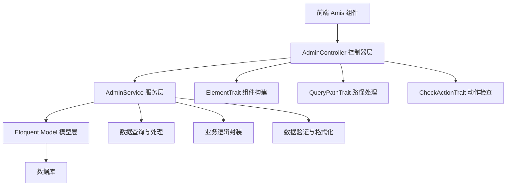

# CRUD 基础概念

## 架构概览

Owl Admin 的 CRUD 功能基于 Laravel 的 Resource Controller 模式，采用分层架构设计：



**核心特性：**
- **统一的 RESTful API 设计**：遵循 Laravel Resource Controller 规范
- **前后端分离架构**：前端 Amis 组件 + 后端 JSON API
- **高度可扩展性**：通过继承和重写实现自定义逻辑
- **组件化构建**：使用 Trait 模块化功能组织
- **管道模式支持**：通过 AdminPipeline 实现组件定制

## 控制器层详解

### 核心方法说明

框架在 `Slowlyo\OwlAdmin\Controllers\AdminController` 中实现了完整的 CRUD 方法：

| 方法        | HTTP 方法 | 路由模式           | 功能描述                    | 返回内容                |
|:----------|:--------|:----------------|:------------------------|:-------------------|
| index()   | GET     | /resource       | 列表页面构建 & 数据获取          | 页面结构 或 列表数据         |
| create()  | GET     | /resource/create | 新增页面构建                 | 新增页面结构             |
| store()   | POST    | /resource       | 新增数据保存                 | 操作结果响应             |
| show()    | GET     | /resource/{id}  | 详情页面构建 & 数据获取          | 页面结构 或 详情数据        |
| edit()    | GET     | /resource/{id}/edit | 编辑页面构建 & 数据回显       | 页面结构 或 编辑数据        |
| update()  | PUT/PATCH | /resource/{id} | 编辑数据保存                 | 操作结果响应             |
| destroy() | DELETE  | /resource/{id}  | 删除数据                   | 操作结果响应             |

### 动作参数机制

控制器通过 `_action` 参数实现一个方法处理多种请求：

```php
public function index()
{
    // 获取列表数据: ?_action=getData
    if ($this->actionOfGetData()) {
        return $this->response()->success($this->service->list());
    }

    // 导出数据: ?_action=export
    if ($this->actionOfExport()) {
        return $this->export();
    }

    // 默认返回页面结构
    return $this->response()->success($this->list());
}
```

**支持的动作类型：**
- `getData` - 获取数据
- `export` - 导出数据
- `quickEdit` - 快速编辑
- `quickEditItem` - 快速编辑单项

### 页面构建方法

控制器需要实现以下抽象方法来构建页面：

```php
abstract class AdminController extends Controller
{
    /**
     * 构建列表页面
     * @return \Slowlyo\OwlAdmin\Renderers\Page
     */
    abstract protected function list();

    /**
     * 构建表单页面
     * @param bool $isEdit 是否为编辑模式
     * @return \Slowlyo\OwlAdmin\Renderers\Form
     */
    abstract protected function form($isEdit);

    /**
     * 构建详情页面
     * @param mixed $id 记录ID
     * @return \Slowlyo\OwlAdmin\Renderers\Form
     */
    abstract protected function detail($id);
}
```

## 服务层详解

### Service 自动注入

控制器通过 `serviceName` 属性自动注入对应的服务实例：

```php
class BookController extends AdminController
{
    protected string $serviceName = BookService::class;

    // $this->service 会自动初始化为 BookService 实例
}
```

### 核心服务方法

AdminService 提供了完整的数据操作方法：

| 方法分类    | 方法名称           | 功能描述           | 返回类型        |
|:--------|:---------------|:---------------|:-----------|
| **查询**  | list()         | 获取分页列表数据       | array      |
|         | listQuery()    | 构建列表查询条件       | Builder    |
|         | getDetail($id) | 获取详情数据         | Model      |
|         | getEditData($id) | 获取编辑回显数据     | Model      |
| **操作**  | store($data)   | 新增数据           | bool       |
|         | update($id, $data) | 更新数据       | bool       |
|         | delete($ids)   | 删除数据           | mixed      |
| **钩子**  | saving($data, $id) | 保存前钩子      | void       |
|         | saved($model, $isEdit) | 保存后钩子   | void       |
|         | deleted($ids)  | 删除后钩子          | void       |

## 开发流程

### 1. 路由注册

在 `app/Admin/routes.php` 中注册 Resource 路由：

```php
$router->resource('books', \App\Admin\Controllers\BookController::class);
```

### 2. 控制器创建

创建控制器 `app/Admin/Controllers/BookController.php`：

```php
<?php

namespace App\Admin\Controllers;

use App\Admin\Services\BookService;
use Slowlyo\OwlAdmin\Controllers\AdminController;

/**
 * 图书管理控制器
 *
 * @property BookService $service
 */
class BookController extends AdminController
{
    protected string $serviceName = BookService::class;

    /**
     * 列表页面构建
     */
    public function list()
    {
        $crud = $this->baseCRUD()
            ->filter($this->baseFilter()->body([
                amis()->TextControl('title', '书名')->size('md')->clearable(),
                amis()->SelectControl('category_id', '分类')
                    ->source('/api/categories')
                    ->clearable(),
            ]))
            ->headerToolbar([
                $this->createButton('dialog'),
                ...$this->baseHeaderToolBar(),
                $this->exportAction(),
            ])
            ->columns([
                amis()->TableColumn('id', 'ID')->sortable(),
                amis()->TableColumn('title', '书名')->searchable(),
                amis()->TableColumn('author', '作者'),
                amis()->TableColumn('category.name', '分类'),
                amis()->TableColumn('price', '价格')->type('number'),
                amis()->TableColumn('status', '状态')->type('mapping')
                    ->map(['1' => '上架', '0' => '下架']),
                amis()->TableColumn('created_at', '创建时间')
                    ->type('datetime')->sortable(),
                $this->rowActions('dialog'),
            ]);

        return $this->baseList($crud);
    }

    /**
     * 表单构建
     */
    public function form($isEdit = false)
    {
        return $this->baseForm()->body([
            amis()->TextControl('title', '书名')->required(),
            amis()->TextControl('author', '作者')->required(),
            amis()->SelectControl('category_id', '分类')
                ->source('/api/categories')->required(),
            amis()->NumberControl('price', '价格')->min(0)->precision(2),
            amis()->SwitchControl('status', '状态')->value(1),
            amis()->TextareaControl('description', '描述')->maxRows(4),
        ]);
    }

    /**
     * 详情页面构建
     */
    public function detail($id)
    {
        return $this->baseDetail()->body([
            amis()->StaticExactControl('id', 'ID'),
            amis()->StaticExactControl('title', '书名'),
            amis()->StaticExactControl('author', '作者'),
            amis()->StaticExactControl('category.name', '分类'),
            amis()->StaticExactControl('price', '价格'),
            amis()->StaticExactControl('status', '状态')
                ->map(['1' => '上架', '0' => '下架']),
            amis()->StaticExactControl('description', '描述'),
            amis()->StaticExactControl('created_at', '创建时间'),
        ]);
    }
}
```

### 3. 服务层创建

创建服务 `app/Admin/Services/BookService.php`：

```php
<?php

namespace App\Admin\Services;

use App\Models\Book;
use Slowlyo\OwlAdmin\Services\AdminService;

/**
 * 图书服务类
 *
 * @method Book getModel()
 * @method Book|Builder query()
 */
class BookService extends AdminService
{
    protected string $modelName = Book::class;

    /**
     * 列表查询条件构建
     */
    public function listQuery()
    {
        $query = $this->query();

        // 处理排序
        $this->sortable($query);

        // 加载关联关系
        $this->addRelations($query);

        // 处理搜索
        $this->searchable($query);

        return $query;
    }

    /**
     * 添加关联关系
     */
    public function addRelations($query, string $scene = 'list')
    {
        if ($scene === 'list') {
            $query->with(['category:id,name']);
        }
    }

    /**
     * 搜索条件处理
     */
    public function searchable($query)
    {
        $title = request('title');
        $categoryId = request('category_id');

        $query->when($title, function($q) use ($title) {
            $q->where('title', 'like', "%{$title}%");
        });

        $query->when($categoryId, function($q) use ($categoryId) {
            $q->where('category_id', $categoryId);
        });
    }

    /**
     * 保存前处理
     */
    public function saving(&$data, $primaryKey = '')
    {
        // 数据预处理
        if (isset($data['price'])) {
            $data['price'] = round($data['price'], 2);
        }
    }

    /**
     * 保存后处理
     */
    public function saved($model, $isEdit = false)
    {
        // 清除相关缓存
        cache()->forget("book_category_{$model->category_id}");

        // 记录操作日志
        admin_log($isEdit ? '更新图书' : '创建图书', $model->toArray());
    }
}
```

### 4. 模型创建

创建模型 `app/Models/Book.php`：

```php
<?php

namespace App\Models;

use Illuminate\Database\Eloquent\Model;
use Illuminate\Database\Eloquent\Relations\BelongsTo;

class Book extends Model
{
    protected $fillable = [
        'title', 'author', 'category_id', 'price', 'status', 'description'
    ];

    protected $casts = [
        'price' => 'decimal:2',
        'status' => 'boolean',
    ];

    /**
     * 分类关联
     */
    public function category(): BelongsTo
    {
        return $this->belongsTo(Category::class);
    }
}
```

### 5. 菜单配置

在后台菜单管理中创建对应菜单项，设置路由为 `/books`。

## 代码生成器

框架提供了强大的代码生成器，可以自动生成完整的 CRUD 代码：

1. **访问代码生成器**：后台 → 开发工具 → 代码生成器
2. **选择数据表**：选择要生成 CRUD 的数据表
3. **配置字段**：设置字段类型、验证规则、显示方式等
4. **生成代码**：一键生成控制器、服务、路由等完整代码

**生成的文件包括：**
- 控制器文件
- 服务文件
- 路由配置
- 菜单配置
- 权限配置

:::tip 提示
使用代码生成器可以大大提高开发效率，生成后只需根据业务需求进行微调即可。
:::

## 最佳实践

### 1. 控制器职责分离

- **控制器**：专注于页面结构构建和请求响应
- **服务层**：处理业务逻辑和数据操作
- **模型层**：定义数据结构和关联关系

### 2. 代码复用

- 使用 `baseCRUD()`、`baseForm()` 等基础方法
- 通过 Trait 封装通用功能
- 利用管道模式实现组件定制

### 3. 性能优化

- 合理使用关联查询避免 N+1 问题
- 适当添加数据库索引
- 使用缓存减少重复查询

### 4. 安全考虑

- 使用表单验证确保数据安全
- 实现权限控制限制访问
- 防止 SQL 注入和 XSS 攻击
