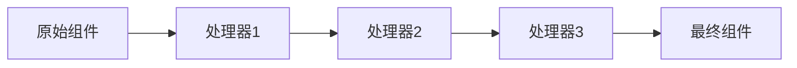

# 组件管道

> v3.9.3 支持

## 管道概念

组件管道允许你在组件渲染前对其进行链式处理和修改，就像流水线一样，组件依次经过多个处理器。每个组件在最终渲染前都会经过管道系统的处理，允许开发者在不修改核心代码的情况下扩展和定制组件行为。



## 工作原理

### 管道执行流程

1. **组件创建**：组件实例化并设置基础属性
2. **管道检索**：从上下文中获取注册的管道处理器
3. **链式处理**：依次执行每个处理器，每个处理器可以修改组件
4. **结果返回**：返回经过所有处理器处理后的最终组件

### 核心机制

管道系统基于 Laravel 的 Pipeline 模式实现，通过 `Admin::context()` 进行管道存储和检索：

```php
// 存储管道到上下文
Admin::context()->set($key, $pipes);

// 从上下文检索管道
$pipes = Admin::context()->get($key, []);

// 执行管道处理
admin_pipeline($passable)->through($pipes)->then($callback);
```

## AdminPipeline 核心类

框架提供了 `AdminPipeline` 类来管理组件管道：

```php
use Slowlyo\OwlAdmin\Support\Cores\AdminPipeline;

// 注册管道处理器
AdminPipeline::through($key, $pipes);

// 执行管道处理
AdminPipeline::handle($key, $passable, $callback);

// 简化的执行方式（无回调）
AdminPipeline::tap($key, $callback);

// 动态生成管道键名
$key = AdminPipeline::parseKey($suffix, $getChild);
```

## 基础使用

### 修改新增按钮

在 `app/Admin/bootstrap.php` 中添加：

```php
use Slowlyo\OwlAdmin\Support\Cores\AdminPipeline;

AdminPipeline::through(
    AdminPipeline::PIPE_CREATE_ACTION,
    [
        function ($schema, $next) {
            // 修改按钮样式
            $schema->label('创建')->level('success');
            return $next($schema);
        },
    ]
);
```

### 修改表单组件

```php
AdminPipeline::through(
    \Slowlyo\OwlAdmin\Renderers\TextControl::class,
    [
        function ($schema, $next) {
            // 为所有文本框添加默认最大长度
            $schema['maxLength'] = 200;
            return $next($schema);
        },
    ]
);
```

## 可用管道常量

框架内置了丰富的管道常量，覆盖了各种组件类型：

### 页面级管道

| 常量 | 说明 | 触发时机 |
|------|------|----------|
| `PIPE_BASE_PAGE` | 基础页面 | 页面组件渲染时 |
| `PIPE_BASE_LIST` | 基础列表页 | 列表页面渲染时 |
| `PIPE_BASE_CRUD` | 基础CRUD页 | CRUD页面渲染时 |

### 表单级管道

| 常量 | 说明 | 触发时机 |
|------|------|----------|
| `PIPE_BASE_FORM` | 基础表单 | 表单组件渲染时 |
| `PIPE_BASE_DETAIL` | 基础详情 | 详情页面渲染时 |
| `PIPE_BASE_FILTER` | 基础筛选器 | 筛选表单渲染时 |

### 按钮级管道

| 常量 | 说明 | 触发时机 |
|------|------|----------|
| `PIPE_CREATE_ACTION` | 新增按钮 | 创建按钮渲染时 |
| `PIPE_EDIT_ACTION` | 编辑按钮 | 编辑按钮渲染时 |
| `PIPE_SHOW_ACTION` | 查看按钮 | 查看按钮渲染时 |
| `PIPE_DELETE_ACTION` | 删除按钮 | 删除按钮渲染时 |
| `PIPE_BACK_ACTION` | 返回按钮 | 返回按钮渲染时 |
| `PIPE_EXPORT_ACTION` | 导出按钮 | 导出按钮渲染时 |
| `PIPE_BULK_DELETE_ACTION` | 批量删除按钮 | 批量删除按钮渲染时 |

### 工具栏级管道

| 常量 | 说明 | 触发时机 |
|------|------|----------|
| `PIPE_ROW_ACTIONS` | 行操作按钮组 | 表格行操作渲染时 |
| `PIPE_BASE_HEADER_TOOLBAR` | 基础头部工具栏 | 头部工具栏渲染时 |

### 组件级管道

除了预定义常量外，每个组件类都可以作为管道键使用：

```php
// 为所有文本输入框添加处理器
AdminPipeline::through(
    \Slowlyo\OwlAdmin\Renderers\TextControl::class,
    [$processor]
);

// 为所有选择框添加处理器
AdminPipeline::through(
    \Slowlyo\OwlAdmin\Renderers\SelectControl::class,
    [$processor]
);
```

## 实际应用案例

### 1. 统一按钮样式

```php
// 统一所有新增按钮的样式
AdminPipeline::through(
    AdminPipeline::PIPE_CREATE_ACTION,
    [
        function ($schema, $next) {
            $schema->icon('fa fa-plus-circle')
                ->level('primary')
                ->size('md');
            return $next($schema);
        },
    ]
);
```

### 2. 添加权限控制

```php
// 为编辑按钮添加权限检查
AdminPipeline::through(
    AdminPipeline::PIPE_EDIT_ACTION,
    [
        function ($schema, $next) {
            // 检查用户权限
            if (!admin_user()->can('edit')) {
                $schema->disabled(true)->disabledTip('无编辑权限');
            }
            return $next($schema);
        },
    ]
);
```

### 3. 表单字段增强

```php
// 为所有选择框添加搜索功能
AdminPipeline::through(
    \Slowlyo\OwlAdmin\Renderers\SelectControl::class,
    [
        function ($schema, $next) {
            $schema['searchable'] = true;
            $schema['clearable'] = true;
            return $next($schema);
        },
    ]
);
```

### 4. 列表组件定制

```php
// 为所有列表添加默认配置
AdminPipeline::through(
    AdminPipeline::PIPE_BASE_CRUD,
    [
        function ($schema, $next) {
            // 添加默认的表格配置
            $schema->set('table.sticky', true)
                ->set('table.resizable', true)
                ->set('table.columnsTogglable', false);
            return $next($schema);
        },
    ]
);
```

## 管道处理器类

### 创建处理器类

```php
<?php

namespace App\Admin\Pipes;

class ButtonStylePipe
{
    public function handle($schema, $next)
    {
        // 统一按钮样式
        if (method_exists($schema, 'level')) {
            $schema->level('primary');
        }
        
        if (method_exists($schema, 'size')) {
            $schema->size('md');
        }
        
        return $next($schema);
    }
}
```

### 使用处理器类

```php
AdminPipeline::through(
    AdminPipeline::PIPE_CREATE_ACTION,
    [
        \App\Admin\Pipes\ButtonStylePipe::class,
        function ($schema, $next) {
            // 其他处理逻辑
            return $next($schema);
        },
    ]
);
```

## 管道链配置

### 多个处理器组合

```php
AdminPipeline::through(
    AdminPipeline::PIPE_CREATE_ACTION,
    [
        // 1. 基础样式处理
        function ($schema, $next) {
            $schema->level('primary')->size('md');
            return $next($schema);
        },
        
        // 2. 权限检查
        function ($schema, $next) {
            if (!admin_user()->can('create')) {
                $schema->disabled(true);
            }
            return $next($schema);
        },
        
        // 3. 图标设置
        function ($schema, $next) {
            $schema->icon('fa fa-plus');
            return $next($schema);
        },
    ]
);
```

### 条件处理

```php
AdminPipeline::through(
    AdminPipeline::PIPE_BASE_FORM,
    [
        function ($schema, $next) {
            // 根据用户角色调整表单
            $user = admin_user();
            
            if ($user->isAdmin()) {
                // 管理员看到所有字段
                $schema->mode('horizontal');
            } else {
                // 普通用户隐藏敏感字段
                $schema->mode('normal');
            }
            
            return $next($schema);
        },
    ]
);
```

## 高级功能

### 动态管道键生成

使用 `parseKey()` 方法可以动态生成管道键：

```php
class CustomController extends AdminController
{
    public function customButton()
    {
        // 生成基于当前类的管道键
        $key = AdminPipeline::parseKey('custom_button');
        // 结果：CustomController:custom_button

        $button = amis()->Button()->label('自定义按钮');

        return AdminPipeline::handle($key, $button);
    }
}
```

### 条件管道注册

根据条件动态注册管道：

```php
// 根据用户角色注册不同的管道
if (admin_user()->isAdmin()) {
    AdminPipeline::through(
        AdminPipeline::PIPE_CREATE_ACTION,
        [AdminButtonPipe::class]
    );
} else {
    AdminPipeline::through(
        AdminPipeline::PIPE_CREATE_ACTION,
        [UserButtonPipe::class]
    );
}
```

### 管道中断处理

在管道中可以中断后续处理：

```php
AdminPipeline::through(
    AdminPipeline::PIPE_CREATE_ACTION,
    [
        function ($schema, $next) {
            // 检查权限，如果无权限则不继续处理
            if (!admin_user()->can('create')) {
                return null; // 中断管道
            }

            return $next($schema);
        },
    ]
);
```

### 管道数据传递

在管道间传递额外数据：

```php
AdminPipeline::through(
    AdminPipeline::PIPE_BASE_FORM,
    [
        function ($schema, $next) {
            // 在组件上设置自定义数据
            $schema->set('_pipeline_data', [
                'user_role' => admin_user()->role,
                'timestamp' => time(),
            ]);

            return $next($schema);
        },
        function ($schema, $next) {
            // 在后续处理器中使用数据
            $data = $schema->get('_pipeline_data');

            if ($data['user_role'] === 'admin') {
                $schema->mode('horizontal');
            }

            return $next($schema);
        },
    ]
);
```

## API 参考

### AdminPipeline 类方法

#### through($key, $pipes)

注册管道处理器到指定键。

**参数：**
- `$key` (string): 管道键名
- `$pipes` (array): 处理器数组

**示例：**
```php
AdminPipeline::through('my_key', [
    MyPipe::class,
    function($schema, $next) { return $next($schema); }
]);
```

#### handle($key, $passable, $callback = null)

执行指定键的管道处理。

**参数：**
- `$key` (string): 管道键名
- `$passable` (mixed): 要处理的对象
- `$callback` (callable|null): 最终回调函数

**返回：** 处理后的对象

#### tap($key, $callback)

简化的管道执行，适用于无需传递对象的场景。

**参数：**
- `$key` (string): 管道键名
- `$callback` (callable): 回调函数

#### parseKey($suffix = '', $getChild = false)

动态生成管道键名。

**参数：**
- `$suffix` (string): 键名后缀
- `$getChild` (bool): 是否获取子类名

**返回：** 生成的键名

### 处理器接口

管道处理器可以是：

1. **闭包函数**
```php
function ($schema, $next) {
    // 处理逻辑
    return $next($schema);
}
```

2. **类方法**
```php
class MyPipe
{
    public function handle($schema, $next)
    {
        // 处理逻辑
        return $next($schema);
    }
}
```

3. **可调用对象**
```php
class MyPipe
{
    public function __invoke($schema, $next)
    {
        // 处理逻辑
        return $next($schema);
    }
}
```

## 最佳实践

### 1. 管道组织
- 将相关的管道配置放在 `app/Admin/bootstrap.php` 中
- 使用类处理器处理复杂逻辑，闭包处理简单逻辑
- 保持管道处理器的单一职责原则
- 按功能模块组织管道配置

### 2. 性能考虑
- 避免在管道中执行数据库查询，使用缓存或预加载
- 缓存重复计算的结果
- 合理控制管道数量，避免过度嵌套
- 在管道开始处进行条件检查，提前退出不必要的处理

### 3. 调试技巧
- 在管道中添加日志记录便于调试
- 使用条件判断避免不必要的处理
- 测试管道的执行顺序和数据传递
- 使用 `dd()` 或 `dump()` 查看管道中的数据状态

### 4. 维护性
- 为管道添加清晰的注释说明用途
- 使用有意义的管道键名，遵循命名规范
- 定期清理不再使用的管道配置
- 建立管道配置的文档记录

### 5. 安全性
- 在管道中进行权限检查
- 验证输入数据的合法性
- 避免在管道中暴露敏感信息
- 对用户输入进行适当的过滤和转义

## 实际应用场景

### 1. 多租户系统

为不同租户定制组件行为：

```php
// 在 app/Admin/bootstrap.php 中
AdminPipeline::through(
    AdminPipeline::PIPE_BASE_CRUD,
    [
        function ($schema, $next) {
            $tenant = admin_user()->tenant;

            // 根据租户配置调整表格
            if ($tenant->type === 'enterprise') {
                $schema->set('table.exportable', true);
                $schema->set('table.printable', true);
            }

            return $next($schema);
        },
    ]
);
```

### 2. 主题定制

根据用户偏好调整组件样式：

```php
AdminPipeline::through(
    AdminPipeline::PIPE_CREATE_ACTION,
    [
        function ($schema, $next) {
            $theme = admin_user()->preference('theme', 'default');

            switch ($theme) {
                case 'dark':
                    $schema->level('secondary');
                    break;
                case 'colorful':
                    $schema->level('success');
                    break;
                default:
                    $schema->level('primary');
            }

            return $next($schema);
        },
    ]
);
```

### 3. 国际化支持

根据语言环境调整组件：

```php
AdminPipeline::through(
    AdminPipeline::PIPE_BASE_FORM,
    [
        function ($schema, $next) {
            $locale = app()->getLocale();

            if ($locale === 'ar') {
                // 阿拉伯语从右到左布局
                $schema->direction('rtl');
            }

            return $next($schema);
        },
    ]
);
```

### 4. 移动端适配

根据设备类型调整组件：

```php
AdminPipeline::through(
    AdminPipeline::PIPE_BASE_CRUD,
    [
        function ($schema, $next) {
            $isMobile = request()->header('User-Agent') &&
                       preg_match('/Mobile|Android|iPhone/', request()->header('User-Agent'));

            if ($isMobile) {
                $schema->set('table.columnsTogglable', true);
                $schema->set('table.affixHeader', false);
            }

            return $next($schema);
        },
    ]
);
```

## 常见问题

### Q: 管道处理器的执行顺序是什么？

A: 管道处理器按照注册时数组的顺序依次执行。如果同一个键注册了多次，后注册的会覆盖前面的。

```php
// 执行顺序：Pipe1 -> Pipe2 -> Pipe3
AdminPipeline::through('key', [Pipe1::class, Pipe2::class, Pipe3::class]);
```

### Q: 如何在管道中获取当前请求信息？

A: 可以直接使用 Laravel 的辅助函数：

```php
AdminPipeline::through(
    AdminPipeline::PIPE_CREATE_ACTION,
    [
        function ($schema, $next) {
            $route = request()->route()->getName();
            $user = admin_user();
            $params = request()->all();

            // 基于请求信息处理组件
            return $next($schema);
        },
    ]
);
```

### Q: 管道处理器中可以抛出异常吗？

A: 可以，但建议谨慎使用。异常会中断管道执行：

```php
AdminPipeline::through(
    AdminPipeline::PIPE_CREATE_ACTION,
    [
        function ($schema, $next) {
            if (!admin_user()->can('create')) {
                throw new \Exception('无创建权限');
            }

            return $next($schema);
        },
    ]
);
```

### Q: 如何调试管道执行过程？

A: 可以在管道中添加日志或使用调试工具：

```php
AdminPipeline::through(
    AdminPipeline::PIPE_CREATE_ACTION,
    [
        function ($schema, $next) {
            \Log::info('管道执行', [
                'schema_type' => get_class($schema),
                'user_id' => admin_user()->id,
            ]);

            return $next($schema);
        },
    ]
);
```

### Q: 管道会影响性能吗？

A: 适度使用不会显著影响性能。建议：
- 避免在管道中执行重型操作
- 使用缓存减少重复计算
- 合理控制管道数量

### Q: 如何清除已注册的管道？

A: 可以通过上下文管理器清除：

```php
// 清除特定键的管道
Admin::context()->forget('pipe_key');

// 清除所有管道
Admin::context()->flush();
```

## 扩展阅读

- [Laravel Pipeline 文档](https://laravel.com/docs/pipeline)
- [组件系统架构](../basic/frame.md#组件系统架构)
- [权限控制](../basic/permission.md)
- [上下文管理](../basic/context.md)
