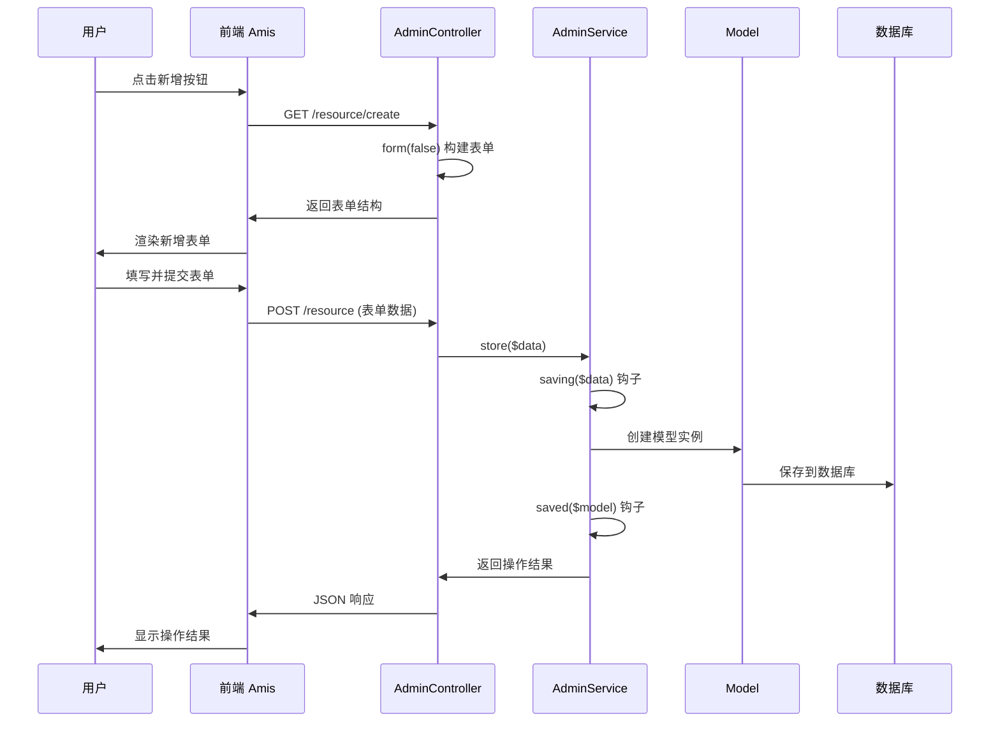

# 新增功能详解

## 新增流程概览

新增功能的完整流程包括表单构建、数据验证、保存处理和响应返回：



## 表单构建详解

### form 方法实现

`form` 方法是构建新增和编辑表单的核心方法：

```php
/**
 * 构建表单结构
 *
 * @param bool $isEdit 是否为编辑模式
 * @return \Slowlyo\OwlAdmin\Renderers\Form
 */
public function form($isEdit = false)
{
    return $this->baseForm($isEdit)->body([
        // 基础信息分组
        amis()->GroupControl()->label('基础信息')->body([
            amis()->TextControl('title', '标题')
                ->required()
                ->maxLength(100)
                ->placeholder('请输入标题'),

            amis()->SelectControl('category_id', '分类')
                ->required()
                ->source('/api/categories')
                ->placeholder('请选择分类'),
        ]),

        // 详细信息分组
        amis()->GroupControl()->label('详细信息')->body([
            amis()->NumberControl('price', '价格')
                ->min(0)
                ->precision(2)
                ->placeholder('请输入价格'),

            amis()->SwitchControl('status', '状态')
                ->value(1)
                ->onText('启用')
                ->offText('禁用'),

            amis()->TextareaControl('description', '描述')
                ->maxRows(4)
                ->placeholder('请输入描述信息'),
        ]),

        // 高级配置分组
        amis()->GroupControl()->label('高级配置')->body([
            amis()->DateTimeControl('publish_at', '发布时间')
                ->format('YYYY-MM-DD HH:mm:ss'),

            amis()->TagControl('tags', '标签')
                ->placeholder('请输入标签，回车确认'),
        ]),
    ]);
}
```

### 表单模式对比

| 模式     | 触发方式                | 表单容器        | API 设置                    | 特点                |
|:-------|:--------------------|:-----------|:---------------------------|:------------------|
| **页面模式** | 访问 `/resource/create` | Card 组件    | `form().api(getStorePath())` | 独立页面，适合复杂表单       |
| **弹窗模式** | 点击新增按钮              | Dialog 组件  | `form().api(getStorePath())` | 浮层显示，适合简单表单       |
| **抽屉模式** | 点击新增按钮              | Drawer 组件  | `form().api(getStorePath())` | 侧边滑出，适合中等复杂度表单    |

### 表单组件类型

框架提供了丰富的表单组件：

```php
// 文本输入
amis()->TextControl('name', '姓名')->required(),

// 数字输入
amis()->NumberControl('age', '年龄')->min(0)->max(120),

// 选择器
amis()->SelectControl('gender', '性别')
    ->options([
        ['label' => '男', 'value' => 1],
        ['label' => '女', 'value' => 2],
    ]),

// 日期时间
amis()->DateTimeControl('birthday', '生日')
    ->format('YYYY-MM-DD'),

// 文件上传
amis()->FileControl('avatar', '头像')
    ->accept('image/*')
    ->maxSize(2 * 1024 * 1024), // 2MB

// 富文本编辑器
amis()->RichTextControl('content', '内容')
    ->vendor('tinymce'),

// 开关
amis()->SwitchControl('is_active', '是否激活')->value(1),

// 多选框
amis()->CheckboxesControl('permissions', '权限')
    ->source('/api/permissions'),
```

### 表单验证

#### 前端验证

```php
amis()->TextControl('email', '邮箱')
    ->required()
    ->validations([
        'isEmail' => true,
        'maxLength' => 50,
    ])
    ->validationErrors([
        'isEmail' => '请输入有效的邮箱地址',
        'maxLength' => '邮箱长度不能超过50个字符',
    ]),

amis()->NumberControl('price', '价格')
    ->required()
    ->min(0)
    ->validations([
        'minimum' => 0,
        'maximum' => 999999.99,
    ]),
```

#### 后端验证

在 Service 的 `saving` 钩子中进行验证：

```php
public function saving(&$data, $primaryKey = '')
{
    // 验证必填字段
    if (empty($data['title'])) {
        admin_abort('标题不能为空');
    }

    // 验证唯一性
    if ($this->query()
        ->where('title', $data['title'])
        ->when($primaryKey, fn($q) => $q->where('id', '!=', $primaryKey))
        ->exists()) {
        admin_abort('标题已存在');
    }

    // 验证数据格式
    if (isset($data['email']) && !filter_var($data['email'], FILTER_VALIDATE_EMAIL)) {
        admin_abort('邮箱格式不正确');
    }
}
```

## 数据保存处理

### store 方法流程

控制器的 `store` 方法处理新增请求：

```php
/**
 * 新增保存
 *
 * @param Request $request
 * @return JsonResponse|JsonResource
 */
public function store(Request $request)
{
    $response = fn($result) => $this->autoResponse($result, admin_trans('admin.save'));

    // 处理快速编辑（表格内编辑）
    if ($this->actionOfQuickEdit()) {
        return $response($this->service->quickEdit($request->all()));
    }

    // 处理快速编辑单项
    if ($this->actionOfQuickEditItem()) {
        return $response($this->service->quickEditItem($request->all()));
    }

    // 标准新增处理
    return $response($this->service->store($request->all()));
}
```

### Service 层处理

AdminService 的 `store` 方法实现：

```php
/**
 * 新增数据
 *
 * @param array $data 表单数据
 * @return bool
 */
public function store($data): bool
{
    DB::beginTransaction();
    try {
        // 保存前钩子
        $this->saving($data);

        $model = $this->getModel();

        // 只保存数据表中存在的字段
        foreach ($data as $k => $v) {
            if (!$this->hasColumn($k)) {
                continue;
            }
            $model->setAttribute($k, $v);
        }

        $result = $model->save();

        if ($result) {
            // 保存后钩子
            $this->saved($model, false);
        }

        DB::commit();
        return $result;
    } catch (\Throwable $e) {
        DB::rollBack();
        admin_abort($e->getMessage());
    }
}
```

### 钩子函数详解

#### saving 钩子（保存前）

```php
/**
 * 保存前处理
 *
 * @param array $data 表单数据
 * @param string $primaryKey 主键值（编辑时有值）
 */
public function saving(&$data, $primaryKey = '')
{
    // 数据预处理
    if (isset($data['price'])) {
        $data['price'] = round($data['price'], 2);
    }

    // 自动设置创建者
    if (!$primaryKey) {
        $data['created_by'] = admin_user()->id;
    }

    // 处理上传文件
    if (isset($data['avatar']) && is_string($data['avatar'])) {
        $data['avatar'] = $this->processUploadedFile($data['avatar']);
    }

    // 数据验证
    $this->validateData($data, $primaryKey);
}

/**
 * 数据验证
 */
private function validateData($data, $primaryKey = '')
{
    $rules = [
        'title' => 'required|max:100',
        'email' => 'required|email|unique:users,email,' . $primaryKey,
        'price' => 'numeric|min:0',
    ];

    $validator = validator($data, $rules);

    if ($validator->fails()) {
        admin_abort($validator->errors()->first());
    }
}
```

#### saved 钩子（保存后）

```php
/**
 * 保存后处理
 *
 * @param Model $model 模型实例
 * @param bool $isEdit 是否为编辑
 */
public function saved($model, $isEdit = false)
{
    // 清除相关缓存
    cache()->forget("category_{$model->category_id}");

    // 处理关联数据
    if (isset($this->request['tags'])) {
        $model->tags()->sync($this->request['tags']);
    }

    // 发送通知
    if (!$isEdit) {
        event(new ModelCreated($model));
    }

    // 记录操作日志
    admin_log($isEdit ? '更新记录' : '创建记录', [
        'model' => get_class($model),
        'id' => $model->getKey(),
        'data' => $model->toArray(),
    ]);
}
```

## 实际应用案例

### 完整的用户管理新增功能

```php
<?php

namespace App\Admin\Controllers;

use App\Admin\Services\UserService;
use Slowlyo\OwlAdmin\Controllers\AdminController;

class UserController extends AdminController
{
    protected string $serviceName = UserService::class;

    public function form($isEdit = false)
    {
        return $this->baseForm()->body([
            // 基础信息
            amis()->GroupControl()->label('基础信息')->body([
                amis()->TextControl('username', '用户名')
                    ->required()
                    ->minLength(3)
                    ->maxLength(20)
                    ->validations(['isAlphanumeric' => true])
                    ->placeholder('3-20位字母数字组合'),

                amis()->TextControl('email', '邮箱')
                    ->required()
                    ->validations(['isEmail' => true])
                    ->placeholder('请输入邮箱地址'),

                amis()->TextControl('phone', '手机号')
                    ->validations(['isPhoneNumber' => true])
                    ->placeholder('请输入手机号'),
            ]),

            // 密码设置（仅新增时显示）
            amis()->GroupControl()
                ->label('密码设置')
                ->visibleOn('!this.id')
                ->body([
                    amis()->PasswordControl('password', '密码')
                        ->required()
                        ->minLength(6)
                        ->placeholder('请输入密码'),

                    amis()->PasswordControl('password_confirmation', '确认密码')
                        ->required()
                        ->validations(['equalsField' => 'password'])
                        ->placeholder('请再次输入密码'),
                ]),

            // 个人信息
            amis()->GroupControl()->label('个人信息')->body([
                amis()->TextControl('real_name', '真实姓名')
                    ->placeholder('请输入真实姓名'),

                amis()->SelectControl('gender', '性别')
                    ->options([
                        ['label' => '男', 'value' => 1],
                        ['label' => '女', 'value' => 2],
                    ])
                    ->placeholder('请选择性别'),

                amis()->DateControl('birthday', '生日')
                    ->format('YYYY-MM-DD')
                    ->placeholder('请选择生日'),

                amis()->FileControl('avatar', '头像')
                    ->accept('image/*')
                    ->maxSize(2 * 1024 * 1024)
                    ->crop(['aspectRatio' => 1])
                    ->placeholder('点击上传头像'),
            ]),

            // 权限设置
            amis()->GroupControl()->label('权限设置')->body([
                amis()->CheckboxesControl('roles', '角色')
                    ->source('/api/roles')
                    ->placeholder('请选择角色'),

                amis()->SwitchControl('is_active', '是否激活')
                    ->value(1)
                    ->onText('激活')
                    ->offText('禁用'),
            ]),
        ]);
    }
}
```

对应的 Service 实现：

```php
<?php

namespace App\Admin\Services;

use App\Models\User;
use Illuminate\Support\Facades\Hash;
use Slowlyo\OwlAdmin\Services\AdminService;

class UserService extends AdminService
{
    protected string $modelName = User::class;

    public function saving(&$data, $primaryKey = '')
    {
        // 密码处理
        if (isset($data['password']) && $data['password']) {
            $data['password'] = Hash::make($data['password']);
        } else {
            unset($data['password']);
        }

        // 移除确认密码字段
        unset($data['password_confirmation']);

        // 验证用户名唯一性
        if (isset($data['username'])) {
            $exists = $this->query()
                ->where('username', $data['username'])
                ->when($primaryKey, fn($q) => $q->where('id', '!=', $primaryKey))
                ->exists();

            if ($exists) {
                admin_abort('用户名已存在');
            }
        }

        // 验证邮箱唯一性
        if (isset($data['email'])) {
            $exists = $this->query()
                ->where('email', $data['email'])
                ->when($primaryKey, fn($q) => $q->where('id', '!=', $primaryKey))
                ->exists();

            if ($exists) {
                admin_abort('邮箱已存在');
            }
        }
    }

    public function saved($model, $isEdit = false)
    {
        // 同步角色
        if (isset($this->request['roles'])) {
            $model->roles()->sync($this->request['roles']);
        }

        // 清除用户相关缓存
        cache()->forget("user_permissions_{$model->id}");

        // 发送欢迎邮件（仅新用户）
        if (!$isEdit && $model->email) {
            // dispatch(new SendWelcomeEmail($model));
        }
    }
}
```

## 错误处理

### 常见错误类型

1. **验证错误**：数据格式不正确、必填字段为空等
2. **业务错误**：违反业务规则、权限不足等
3. **系统错误**：数据库连接失败、文件上传失败等

### 错误处理机制

```php
public function store($data): bool
{
    DB::beginTransaction();
    try {
        $this->saving($data);

        $model = $this->getModel();
        foreach ($data as $k => $v) {
            if ($this->hasColumn($k)) {
                $model->setAttribute($k, $v);
            }
        }

        $result = $model->save();

        if ($result) {
            $this->saved($model, false);
        }

        DB::commit();
        return $result;

    } catch (\Illuminate\Validation\ValidationException $e) {
        DB::rollBack();
        admin_abort($e->validator->errors()->first());

    } catch (\Exception $e) {
        DB::rollBack();
        admin_log_error('用户创建失败', [
            'error' => $e->getMessage(),
            'data' => $data,
        ]);
        admin_abort('创建失败，请稍后重试');
    }
}
```

### 前端错误显示

框架会自动处理错误响应并在前端显示：

```json
{
    "status": 0,
    "msg": "用户名已存在",
    "data": null
}
```

前端会自动显示错误提示，无需额外处理。

## 性能优化

### 1. 数据库优化

```php
// 批量插入
public function batchStore($dataList): bool
{
    DB::beginTransaction();
    try {
        foreach ($dataList as $data) {
            $this->saving($data);
        }

        $this->getModel()::insert($dataList);

        DB::commit();
        return true;
    } catch (\Exception $e) {
        DB::rollBack();
        throw $e;
    }
}
```

### 2. 文件上传优化

```php
// 异步处理大文件
public function saving(&$data, $primaryKey = '')
{
    if (isset($data['large_file'])) {
        // 先保存文件路径，后台异步处理
        $data['file_status'] = 'processing';
        dispatch(new ProcessLargeFile($data['large_file']));
    }
}
```

### 3. 缓存策略

```php
public function saved($model, $isEdit = false)
{
    // 更新相关缓存
    cache()->put("user_{$model->id}", $model, 3600);

    // 清除列表缓存
    cache()->forget('user_list');
}
```
