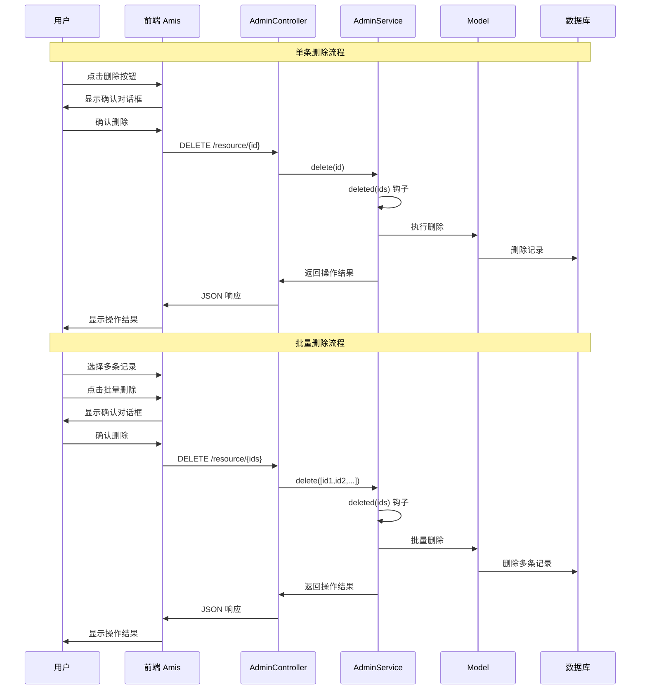

# 删除功能详解

## 删除流程概览

删除功能包括单条删除、批量删除、软删除等多种模式：



## 删除按钮配置

### 列表页删除按钮

控制器中的 `list` 方法负责构建数据列表和删除按钮：

```php
public function list()
{
    $crud = $this->baseCRUD()
        // 配置批量操作
        ->bulkActions([
            $this->bulkDeleteButton(), // 批量删除按钮

            // 自定义批量删除按钮
            amis()->Button('批量删除')
                ->level('danger')
                ->actionType('ajax')
                ->api('delete:' . $this->getDestroyPath())
                ->confirmText('确定要删除选中的记录吗？')
                ->reload('window'),

            // 批量软删除
            amis()->Button('移至回收站')
                ->level('warning')
                ->actionType('ajax')
                ->api('put:' . admin_url('trash/move'))
                ->confirmText('确定要将选中记录移至回收站吗？')
                ->reload('window'),
        ])

        // 配置选择条件
        ->itemCheckableOn('${!is_system}') // 系统数据不可选择删除

        ->columns([
            amis()->TableColumn('id', 'ID')->sortable(),
            amis()->TableColumn('title', '标题'),
            amis()->TableColumn('status', '状态')
                ->type('mapping')
                ->map([
                    1 => '<span class="label label-success">启用</span>',
                    0 => '<span class="label label-danger">禁用</span>',
                ]),

            // 行内操作按钮
            $this->rowActions([
                $this->rowEditButton(true), // 编辑按钮

                // 自定义删除按钮
                amis()->Button('删除')
                    ->level('link')
                    ->className('text-danger')
                    ->actionType('ajax')
                    ->api('delete:' . $this->getDestroyPath() . '/${id}')
                    ->confirmText('确定要删除此记录吗？')
                    ->visibleOn('${!is_system}') // 系统数据不显示删除按钮
                    ->reload('window'),

                // 软删除按钮
                amis()->Button('移至回收站')
                    ->level('link')
                    ->className('text-warning')
                    ->actionType('ajax')
                    ->api('put:' . admin_url('trash/move/${id}'))
                    ->confirmText('确定要将此记录移至回收站吗？')
                    ->reload('window'),
            ]),
        ]);

    return $this->baseList($crud);
}
```

### 删除按钮权限控制

```php
public function list()
{
    $crud = $this->baseCRUD()
        ->bulkActions([
            // 根据权限显示批量删除按钮
            admin_user()->can('delete', $this->modelName)
                ? $this->bulkDeleteButton()
                : null,
        ])
        ->columns([
            // ...
            $this->rowActions([
                $this->rowEditButton(true),

                // 根据权限和数据状态显示删除按钮
                amis()->Button('删除')
                    ->level('link')
                    ->className('text-danger')
                    ->actionType('ajax')
                    ->api('delete:' . $this->getDestroyPath() . '/${id}')
                    ->confirmText('确定要删除此记录吗？')
                    ->visibleOn('${!is_system && can_delete}') // 多条件控制
                    ->reload('window'),
            ]),
        ]);

    return $this->baseList($crud);
}

/**
 * 在数据查询时添加权限字段
 */
public function list()
{
    // 在查询时添加权限判断字段
    $this->service->addSelectRaw([
        DB::raw('(CASE WHEN is_system = 0 AND created_by = ' . admin_user()->id . ' THEN 1 ELSE 0 END) as can_delete')
    ]);

    // ... 其他代码
}
```

## 删除方法实现

### destroy 方法处理

控制器的 `destroy` 方法处理删除请求：

```php
/**
 * 删除记录
 *
 * @param mixed $ids 单个ID或多个ID（逗号分隔）
 * @return JsonResponse|JsonResource
 */
public function destroy($ids)
{
    $response = fn($result) => $this->autoResponse($result, admin_trans('admin.delete'));

    return $response($this->service->delete($ids));
}
```

### Service 层删除实现

```php
/**
 * 删除数据
 *
 * @param mixed $ids 单个ID或ID数组
 * @return bool|mixed
 */
public function delete($ids)
{
    // 统一处理ID格式
    if (is_string($ids)) {
        $ids = explode(',', $ids);
    }

    if (!is_array($ids)) {
        $ids = [$ids];
    }

    DB::beginTransaction();
    try {
        // 删除前验证
        $this->validateDelete($ids);

        // 删除前钩子
        $this->deleted($ids);

        // 执行删除
        $result = $this->performDelete($ids);

        DB::commit();
        return $result;

    } catch (\Throwable $e) {
        DB::rollBack();
        admin_abort($e->getMessage());
    }
}

/**
 * 执行删除操作
 */
protected function performDelete($ids)
{
    $query = $this->query()->whereIn($this->primaryKey(), $ids);

    // 检查是否使用软删除
    if ($this->usesSoftDeletes()) {
        return $query->delete(); // 软删除
    } else {
        return $query->forceDelete(); // 硬删除
    }
}

/**
 * 检查是否使用软删除
 */
protected function usesSoftDeletes(): bool
{
    $model = $this->getModel();
    return method_exists($model, 'bootSoftDeletes');
}
```

## 删除类型详解

### 1. 软删除（推荐）

软删除不会真正删除数据，而是标记为已删除状态：

```php
use Illuminate\Database\Eloquent\SoftDeletes;

class User extends Model
{
    use SoftDeletes;

    protected $dates = ['deleted_at'];
}

// Service 中的软删除实现
public function delete($ids)
{
    if (is_string($ids)) {
        $ids = explode(',', $ids);
    }

    // 软删除前验证
    $models = $this->query()->whereIn($this->primaryKey(), $ids)->get();

    foreach ($models as $model) {
        if (!$this->canDelete($model)) {
            admin_abort("记录 {$model->id} 不允许删除");
        }
    }

    // 删除前钩子
    $this->deleted($ids);

    // 执行软删除
    $result = $this->query()->whereIn($this->primaryKey(), $ids)->delete();

    // 记录删除日志
    admin_log('软删除记录', [
        'model' => $this->modelName,
        'ids' => $ids,
        'count' => count($ids),
    ]);

    return $result;
}

/**
 * 恢复软删除的记录
 */
public function restore($ids)
{
    if (is_string($ids)) {
        $ids = explode(',', $ids);
    }

    $result = $this->query()
        ->onlyTrashed()
        ->whereIn($this->primaryKey(), $ids)
        ->restore();

    admin_log('恢复删除记录', [
        'model' => $this->modelName,
        'ids' => $ids,
    ]);

    return $result;
}

/**
 * 永久删除
 */
public function forceDelete($ids)
{
    if (is_string($ids)) {
        $ids = explode(',', $ids);
    }

    // 删除前清理关联数据
    $models = $this->query()
        ->onlyTrashed()
        ->whereIn($this->primaryKey(), $ids)
        ->get();

    foreach ($models as $model) {
        $this->cleanupRelatedData($model);
    }

    $result = $this->query()
        ->onlyTrashed()
        ->whereIn($this->primaryKey(), $ids)
        ->forceDelete();

    admin_log('永久删除记录', [
        'model' => $this->modelName,
        'ids' => $ids,
    ]);

    return $result;
}
```

### 2. 硬删除

直接从数据库中删除记录：

```php
public function delete($ids)
{
    if (is_string($ids)) {
        $ids = explode(',', $ids);
    }

    // 删除前备份数据
    $models = $this->query()->whereIn($this->primaryKey(), $ids)->get();
    $backupData = $models->toArray();

    // 删除前钩子
    $this->deleted($ids);

    // 清理关联数据
    foreach ($models as $model) {
        $this->cleanupRelatedData($model);
    }

    // 执行硬删除
    $result = $this->query()->whereIn($this->primaryKey(), $ids)->delete();

    // 记录删除日志（包含备份数据）
    admin_log('硬删除记录', [
        'model' => $this->modelName,
        'ids' => $ids,
        'backup_data' => $backupData,
    ]);

    return $result;
}
```

## 删除权限控制

### 权限验证

```php
/**
 * 验证删除权限
 */
protected function validateDelete($ids)
{
    $models = $this->query()->whereIn($this->primaryKey(), $ids)->get();

    foreach ($models as $model) {
        // 检查基础删除权限
        if (!$this->canDelete($model)) {
            admin_abort("记录 {$model->id} 不允许删除");
        }

        // 检查业务规则
        $this->validateBusinessRules($model);

        // 检查关联数据
        $this->validateRelatedData($model);
    }
}

/**
 * 检查是否可以删除
 */
protected function canDelete($model): bool
{
    // 系统数据不允许删除
    if (isset($model->is_system) && $model->is_system) {
        return false;
    }

    // 检查用户权限
    if (!admin_user()->can('delete', $model)) {
        return false;
    }

    // 创建者才能删除自己的记录
    if (isset($model->created_by) && $model->created_by !== admin_user()->id) {
        if (!admin_user()->hasRole('admin')) {
            return false;
        }
    }

    return true;
}

/**
 * 验证业务规则
 */
protected function validateBusinessRules($model)
{
    // 示例：订单已支付不能删除
    if ($model instanceof Order && $model->status === 'paid') {
        admin_abort('已支付的订单不能删除');
    }

    // 示例：有子记录的分类不能删除
    if ($model instanceof Category && $model->children()->exists()) {
        admin_abort('存在子分类的分类不能删除');
    }
}

/**
 * 验证关联数据
 */
protected function validateRelatedData($model)
{
    // 检查是否有关联数据
    if ($model instanceof User && $model->orders()->exists()) {
        admin_abort('用户存在订单记录，不能删除');
    }

    if ($model instanceof Category && $model->products()->exists()) {
        admin_abort('分类下存在商品，不能删除');
    }
}
```

## 批量删除功能

### 前端批量删除配置

```php
public function list()
{
    $crud = $this->baseCRUD()
        // 配置批量操作
        ->bulkActions([
            amis()->Button('批量删除')
                ->level('danger')
                ->actionType('ajax')
                ->api('delete:' . $this->getDestroyPath())
                ->confirmText('确定要删除选中的记录吗？')
                ->reload('window'),

            amis()->Button('批量禁用')
                ->level('warning')
                ->actionType('ajax')
                ->api('put:' . $this->getUpdatePath())
                ->data(['status' => 0])
                ->confirmText('确定要禁用选中的记录吗？')
                ->reload('window'),
        ])

        // 配置选择列
        ->itemCheckableOn('${!is_system}') // 系统数据不可选择

        ->columns([
            amis()->TableColumn('id', 'ID')->sortable(),
            // ... 其他列
        ]);

    return $this->baseList($crud);
}
```

### 批量删除实现

```php
/**
 * 批量删除处理
 */
public function destroy($ids)
{
    // 解析批量ID
    if (is_string($ids)) {
        $ids = explode(',', $ids);
    }

    // 限制批量删除数量
    if (count($ids) > 100) {
        admin_abort('单次最多只能删除100条记录');
    }

    $result = $this->service->batchDelete($ids);

    return $this->autoResponse($result, admin_trans('admin.delete'));
}

/**
 * Service 中的批量删除
 */
public function batchDelete($ids): bool
{
    DB::beginTransaction();
    try {
        $successCount = 0;
        $failedIds = [];

        foreach ($ids as $id) {
            try {
                $this->delete($id);
                $successCount++;
            } catch (\Exception $e) {
                $failedIds[] = $id;
                admin_log_error("删除记录失败", [
                    'id' => $id,
                    'error' => $e->getMessage(),
                ]);
            }
        }

        DB::commit();

        if (!empty($failedIds)) {
            admin_abort("成功删除 {$successCount} 条记录，失败 " . count($failedIds) . " 条");
        }

        return true;

    } catch (\Exception $e) {
        DB::rollBack();
        throw $e;
    }
}
```

## 删除钩子函数

### deleted 钩子（删除前）

```php
/**
 * 删除前处理
 *
 * @param array $ids 要删除的ID数组
 */
public function deleted($ids)
{
    $models = $this->query()->whereIn($this->primaryKey(), $ids)->get();

    foreach ($models as $model) {
        // 清理上传文件
        $this->cleanupFiles($model);

        // 清理关联数据
        $this->cleanupRelatedData($model);

        // 清理缓存
        $this->cleanupCache($model);

        // 发送通知
        $this->sendDeleteNotification($model);
    }
}

/**
 * 清理上传文件
 */
protected function cleanupFiles($model)
{
    $fileFields = ['avatar', 'cover', 'attachments'];

    foreach ($fileFields as $field) {
        if (isset($model->$field) && $model->$field) {
            if (is_array($model->$field)) {
                foreach ($model->$field as $file) {
                    $this->deleteFile($file);
                }
            } else {
                $this->deleteFile($model->$field);
            }
        }
    }
}

/**
 * 清理关联数据
 */
protected function cleanupRelatedData($model)
{
    // 删除关联的标签
    if (method_exists($model, 'tags')) {
        $model->tags()->detach();
    }

    // 删除关联的评论
    if (method_exists($model, 'comments')) {
        $model->comments()->delete();
    }

    // 删除关联的日志
    if (method_exists($model, 'logs')) {
        $model->logs()->delete();
    }
}

/**
 * 清理缓存
 */
protected function cleanupCache($model)
{
    $cacheKeys = [
        "model_{$model->id}",
        "user_permissions_{$model->id}",
        "category_products_{$model->category_id}",
    ];

    foreach ($cacheKeys as $key) {
        cache()->forget($key);
    }
}
```

## 回收站功能

### 回收站列表

```php
/**
 * 回收站控制器
 */
class TrashController extends AdminController
{
    protected string $serviceName = TrashService::class;

    public function list()
    {
        $crud = $this->baseCRUD()
            ->headerToolbar([
                amis()->Button('清空回收站')
                    ->level('danger')
                    ->actionType('ajax')
                    ->api('delete:' . admin_url('trash/clear'))
                    ->confirmText('确定要清空回收站吗？此操作不可恢复！'),
            ])
            ->bulkActions([
                amis()->Button('批量恢复')
                    ->level('success')
                    ->actionType('ajax')
                    ->api('put:' . admin_url('trash/restore'))
                    ->confirmText('确定要恢复选中的记录吗？'),

                amis()->Button('永久删除')
                    ->level('danger')
                    ->actionType('ajax')
                    ->api('delete:' . admin_url('trash/force-delete'))
                    ->confirmText('确定要永久删除选中的记录吗？此操作不可恢复！'),
            ])
            ->columns([
                amis()->TableColumn('id', 'ID'),
                amis()->TableColumn('title', '标题'),
                amis()->TableColumn('deleted_at', '删除时间')->type('datetime'),
                amis()->TableColumn('deleted_by_user.username', '删除人'),

                // 操作列
                amis()->TableColumn('actions', '操作')
                    ->type('operation')
                    ->buttons([
                        amis()->Button('恢复')
                            ->level('success')
                            ->size('sm')
                            ->actionType('ajax')
                            ->api('put:' . admin_url('trash/restore/${id}'))
                            ->confirmText('确定要恢复此记录吗？'),

                        amis()->Button('永久删除')
                            ->level('danger')
                            ->size('sm')
                            ->actionType('ajax')
                            ->api('delete:' . admin_url('trash/force-delete/${id}'))
                            ->confirmText('确定要永久删除此记录吗？此操作不可恢复！'),
                    ]),
            ]);

        return $this->baseList($crud);
    }

    /**
     * 恢复记录
     */
    public function restore($ids)
    {
        $result = $this->service->restore($ids);
        return $this->autoResponse($result, '恢复成功');
    }

    /**
     * 永久删除
     */
    public function forceDelete($ids)
    {
        $result = $this->service->forceDelete($ids);
        return $this->autoResponse($result, '永久删除成功');
    }

    /**
     * 清空回收站
     */
    public function clear()
    {
        $result = $this->service->clearTrash();
        return $this->autoResponse($result, '回收站已清空');
    }
}
```

## 实际应用案例

### 完整的用户删除功能

```php
<?php

namespace App\Admin\Services;

use App\Models\User;
use Illuminate\Support\Facades\Storage;
use Slowlyo\OwlAdmin\Services\AdminService;

class UserService extends AdminService
{
    protected string $modelName = User::class;

    /**
     * 删除用户
     */
    public function delete($ids)
    {
        if (is_string($ids)) {
            $ids = explode(',', $ids);
        }

        DB::beginTransaction();
        try {
            $users = $this->query()->whereIn('id', $ids)->get();

            foreach ($users as $user) {
                // 验证删除权限
                $this->validateUserDelete($user);

                // 处理用户数据
                $this->handleUserDeletion($user);
            }

            // 执行软删除
            $result = $this->query()->whereIn('id', $ids)->delete();

            // 删除后处理
            $this->deleted($ids);

            DB::commit();
            return $result;

        } catch (\Exception $e) {
            DB::rollBack();
            admin_abort($e->getMessage());
        }
    }

    /**
     * 验证用户删除
     */
    protected function validateUserDelete($user)
    {
        // 超级管理员不能删除
        if ($user->hasRole('super-admin')) {
            admin_abort('超级管理员不能删除');
        }

        // 当前用户不能删除自己
        if ($user->id === admin_user()->id) {
            admin_abort('不能删除当前登录用户');
        }

        // 检查是否有重要关联数据
        if ($user->orders()->where('status', 'processing')->exists()) {
            admin_abort('用户有正在处理的订单，不能删除');
        }
    }

    /**
     * 处理用户删除
     */
    protected function handleUserDeletion($user)
    {
        // 匿名化敏感数据
        $user->update([
            'email' => 'deleted_' . $user->id . '@example.com',
            'phone' => null,
            'real_name' => '已删除用户',
        ]);

        // 删除头像文件
        if ($user->avatar) {
            Storage::delete($user->avatar);
        }

        // 清理会话
        $user->sessions()->delete();

        // 撤销所有角色
        $user->roles()->detach();

        // 清理权限缓存
        cache()->forget("user_permissions_{$user->id}");
    }

    /**
     * 删除后处理
     */
    public function deleted($ids)
    {
        // 记录删除日志
        admin_log('删除用户', [
            'user_ids' => $ids,
            'operator' => admin_user()->username,
            'deleted_at' => now(),
        ]);

        // 发送通知给管理员
        // event(new UsersDeleted($ids));

        // 清理相关缓存
        cache()->forget('active_users_count');
        cache()->forget('user_statistics');
    }

    /**
     * 恢复用户
     */
    public function restore($ids)
    {
        if (is_string($ids)) {
            $ids = explode(',', $ids);
        }

        $result = $this->query()
            ->onlyTrashed()
            ->whereIn('id', $ids)
            ->restore();

        // 恢复后处理
        foreach ($ids as $id) {
            $user = $this->query()->find($id);
            if ($user) {
                // 重新分配默认角色
                $user->assignRole('user');

                // 清理缓存
                cache()->forget("user_permissions_{$id}");
            }
        }

        admin_log('恢复用户', ['user_ids' => $ids]);

        return $result;
    }
}
```

### 分类删除功能（级联处理）

```php
<?php

namespace App\Admin\Services;

use App\Models\Category;
use Slowlyo\OwlAdmin\Services\AdminService;

class CategoryService extends AdminService
{
    protected string $modelName = Category::class;

    public function delete($ids)
    {
        if (is_string($ids)) {
            $ids = explode(',', $ids);
        }

        DB::beginTransaction();
        try {
            foreach ($ids as $id) {
                $this->deleteCategoryWithChildren($id);
            }

            DB::commit();
            return true;

        } catch (\Exception $e) {
            DB::rollBack();
            admin_abort($e->getMessage());
        }
    }

    /**
     * 递归删除分类及其子分类
     */
    protected function deleteCategoryWithChildren($id)
    {
        $category = $this->query()->find($id);

        if (!$category) {
            return;
        }

        // 检查是否有商品
        if ($category->products()->exists()) {
            admin_abort("分类 '{$category->name}' 下存在商品，不能删除");
        }

        // 递归删除子分类
        $children = $category->children()->get();
        foreach ($children as $child) {
            $this->deleteCategoryWithChildren($child->id);
        }

        // 删除当前分类
        $category->delete();

        // 清理缓存
        cache()->forget("category_tree");
        cache()->forget("category_{$id}");
    }
}
```

## 安全注意事项

### 1. 防止误删

```php
/**
 * 重要数据删除确认
 */
public function destroy($ids)
{
    // 检查是否为重要数据
    $models = $this->service->query()->whereIn('id', explode(',', $ids))->get();

    foreach ($models as $model) {
        if ($this->isImportantData($model)) {
            // 要求二次确认
            if (!request()->has('force_delete')) {
                return $this->response()->fail('重要数据需要二次确认删除');
            }
        }
    }

    return $this->autoResponse($this->service->delete($ids), admin_trans('admin.delete'));
}

protected function isImportantData($model): bool
{
    // 系统数据
    if (isset($model->is_system) && $model->is_system) {
        return true;
    }

    // 有大量关联数据
    if ($model instanceof User && $model->orders()->count() > 100) {
        return true;
    }

    return false;
}
```

### 2. 删除日志记录

```php
public function deleted($ids)
{
    $models = $this->query()->whereIn($this->primaryKey(), $ids)->get();

    foreach ($models as $model) {
        // 详细记录删除信息
        admin_log('删除记录', [
            'model' => get_class($model),
            'id' => $model->getKey(),
            'data' => $model->toArray(),
            'operator' => admin_user()->username,
            'ip' => request()->ip(),
            'user_agent' => request()->userAgent(),
            'deleted_at' => now(),
        ]);
    }
}
```

### 3. 数据备份

```php
public function delete($ids)
{
    if (is_string($ids)) {
        $ids = explode(',', $ids);
    }

    // 删除前备份重要数据
    $models = $this->query()->whereIn($this->primaryKey(), $ids)->get();
    $this->backupBeforeDelete($models);

    // 执行删除
    return parent::delete($ids);
}

protected function backupBeforeDelete($models)
{
    foreach ($models as $model) {
        // 备份到专门的备份表
        DB::table('deleted_data_backup')->insert([
            'model_type' => get_class($model),
            'model_id' => $model->getKey(),
            'data' => json_encode($model->toArray()),
            'deleted_by' => admin_user()->id,
            'deleted_at' => now(),
        ]);
    }
}
```

## 性能优化

### 1. 批量操作优化

```php
public function batchDelete($ids): bool
{
    // 分批处理大量数据
    $chunks = array_chunk($ids, 100);

    foreach ($chunks as $chunk) {
        $this->query()->whereIn($this->primaryKey(), $chunk)->delete();
    }

    return true;
}
```

### 2. 异步删除

```php
public function delete($ids)
{
    // 对于大量数据，使用队列异步处理
    if (count($ids) > 1000) {
        dispatch(new BatchDeleteJob($this->modelName, $ids));
        return true;
    }

    return $this->performDelete($ids);
}
```

### 3. 软删除索引优化

```php
// 数据库迁移中添加软删除索引
Schema::table('users', function (Blueprint $table) {
    $table->index(['deleted_at', 'created_at']);
});
```

## 最佳实践

1. **优先使用软删除**：对于重要数据，建议使用软删除而非硬删除
2. **权限控制**：严格控制删除权限，防止误删重要数据
3. **关联检查**：删除前检查关联数据，避免数据完整性问题
4. **日志记录**：详细记录删除操作，便于审计和恢复
5. **数据备份**：重要数据删除前进行备份
6. **批量限制**：限制批量删除的数量，防止系统负载过高
7. **异步处理**：大量数据删除使用队列异步处理
8. **用户确认**：重要操作需要用户二次确认
9. **回收站功能**：提供回收站功能，允许用户恢复误删数据
10. **性能优化**：合理使用索引，优化删除查询性能
