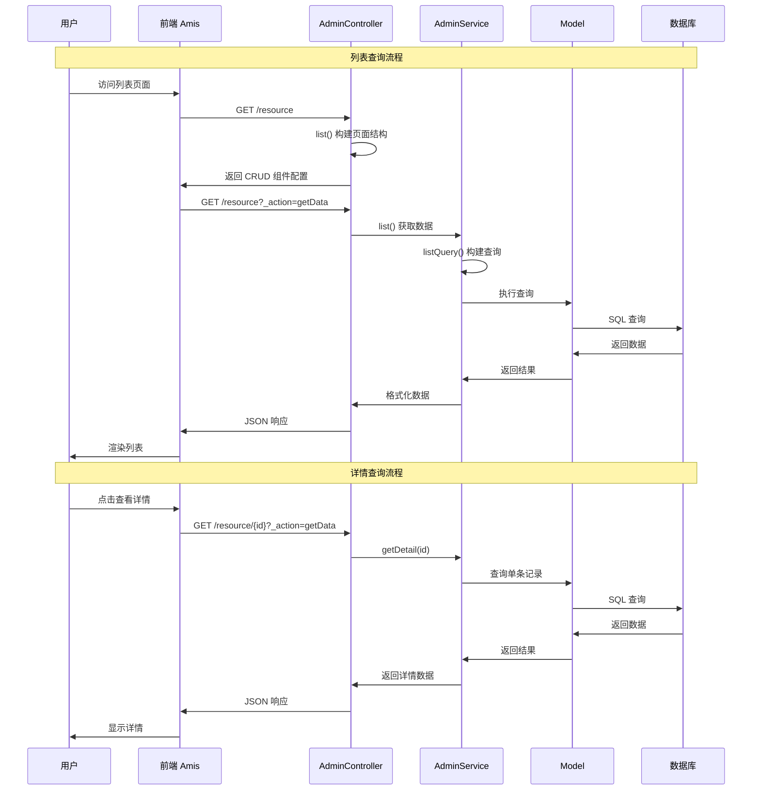

# 查询功能详解

## 查询流程概览

查询功能包括列表展示和详情查看两个核心部分：



## 列表功能详解

### index 方法的多重职责

`index` 方法通过 `_action` 参数处理不同类型的请求：

```php
public function index()
{
    // 获取列表数据: ?_action=getData
    if ($this->actionOfGetData()) {
        return $this->response()->success($this->service->list());
    }

    // 导出数据: ?_action=export
    if ($this->actionOfExport()) {
        return $this->export();
    }

    // 默认返回页面结构（无 _action 参数）
    return $this->response()->success($this->list());
}
```

**请求类型对应关系：**

| 请求类型      | URL 示例                             | 处理方法                  | 返回内容     |
|:----------|:-----------------------------------|:----------------------|:---------|
| 页面结构      | `/users`                           | `list()`              | CRUD 组件配置 |
| 列表数据      | `/users?_action=getData`           | `service->list()`     | 分页数据     |
| 导出数据      | `/users?_action=export`            | `export()`            | 导出文件     |
| 快速编辑      | `post:/users?_action=quickEdit`    | `service->quickEdit()`   | 操作结果     |
| 快速编辑单项  | `post:/users?_action=quickEditItem` | `service->quickEditItem()` | 操作结果     |

### list 方法构建页面结构

`list` 方法负责构建完整的 CRUD 页面结构：

```php
public function list()
{
    $crud = $this->baseCRUD()
        // 配置筛选器
        ->filter($this->buildFilter())
        // 配置头部工具栏
        ->headerToolbar($this->buildHeaderToolbar())
        // 配置表格列
        ->columns($this->buildColumns())
        // 配置批量操作
        ->bulkActions($this->buildBulkActions())
        // 配置底部工具栏
        ->footerToolbar($this->buildFooterToolbar());

    return $this->baseList($crud);
}

/**
 * 构建筛选器
 */
protected function buildFilter()
{
    return $this->baseFilter()->body([
        // 文本搜索
        amis()->TextControl('keyword', '关键词')
            ->size('md')
            ->clearable()
            ->placeholder('请输入关键词搜索'),

        // 状态筛选
        amis()->SelectControl('status', '状态')
            ->options([
                ['label' => '全部', 'value' => ''],
                ['label' => '启用', 'value' => 1],
                ['label' => '禁用', 'value' => 0],
            ])
            ->clearable(),

        // 日期范围
        amis()->DateRangeControl('created_at', '创建时间')
            ->format('YYYY-MM-DD')
            ->clearable(),

        // 分类筛选
        amis()->SelectControl('category_id', '分类')
            ->source('/api/categories')
            ->clearable(),
    ]);
}

/**
 * 构建头部工具栏
 */
protected function buildHeaderToolbar()
{
    return [
        $this->createButton('dialog'),  // 新增按钮
        'bulkActions',                  // 批量操作
        amis('reload')->align('right'), // 刷新按钮
        amis('filter-toggler')->align('right'), // 筛选器切换
        $this->exportAction(),          // 导出按钮
    ];
}

/**
 * 构建表格列
 */
protected function buildColumns()
{
    return [
        // 选择列
        amis()->TableColumn('id', 'ID')
            ->sortable()
            ->width(80),

        // 基础信息列
        amis()->TableColumn('title', '标题')
            ->searchable()
            ->copyable(),

        // 关联数据列
        amis()->TableColumn('category.name', '分类')
            ->placeholder('未分类'),

        // 状态列（映射显示）
        amis()->TableColumn('status', '状态')
            ->type('mapping')
            ->map([
                '1' => '<span class="label label-success">启用</span>',
                '0' => '<span class="label label-default">禁用</span>',
            ]),

        // 数值列
        amis()->TableColumn('price', '价格')
            ->type('number')
            ->precision(2)
            ->prefix('¥'),

        // 时间列
        amis()->TableColumn('created_at', '创建时间')
            ->type('datetime')
            ->format('YYYY-MM-DD HH:mm:ss')
            ->sortable(),

        // 操作列
        $this->rowActions('dialog'),
    ];
}
```

### 高级列表配置

#### 表格样式定制

```php
$crud = $this->baseCRUD()
    // 表格样式
    ->className('table-responsive')
    ->tableClassName('table table-striped')

    // 分页配置
    ->perPage(20)
    ->perPageAvailable([10, 20, 50, 100])
    ->alwaysShowPagination()

    // 头部固定
    ->affixHeader(true)

    // 筛选器配置
    ->filterTogglable(true)
    ->filterDefaultVisible(false)

    // 加载配置
    ->loadDataOnce(false)
    ->syncLocation(true);
```

#### 条件渲染

```php
amis()->TableColumn('actions', '操作')
    ->type('operation')
    ->buttons([
        amis()->Button('编辑')
            ->level('link')
            ->visibleOn('${status == 1}'), // 仅启用状态显示

        amis()->Button('删除')
            ->level('link')
            ->className('text-danger')
            ->disabledOn('${is_system == 1}'), // 系统数据禁用删除
    ]),
```

## 数据查询处理

### Service 层查询方法

#### list 方法（分页查询）

```php
/**
 * 获取分页列表数据
 *
 * @return array
 */
public function list()
{
    $query = $this->listQuery();

    // 分页查询
    $perPage = request()->input('perPage', 20);
    $list = $query->paginate($perPage);

    // 格式化数据
    $items = $this->formatRows($list->items());
    $total = $list->total();

    return compact('items', 'total');
}
```

#### listQuery 方法（查询构建）

```php
/**
 * 构建列表查询条件
 *
 * @return Builder
 */
public function listQuery()
{
    $query = $this->query();

    // 处理排序
    $this->sortable($query);

    // 自动加载关联关系
    $this->loadRelations($query);

    // 处理搜索条件
    $this->searchable($query);

    // 添加自定义关联
    $this->addRelations($query, 'list');

    return $query;
}
```

#### 搜索条件处理

```php
/**
 * 处理搜索条件
 *
 * @param Builder $query
 */
public function searchable($query)
{
    // 关键词搜索
    $keyword = request('keyword');
    if ($keyword) {
        $query->where(function($q) use ($keyword) {
            $q->where('title', 'like', "%{$keyword}%")
              ->orWhere('description', 'like', "%{$keyword}%");
        });
    }

    // 状态筛选
    $status = request('status');
    if ($status !== null && $status !== '') {
        $query->where('status', $status);
    }

    // 分类筛选
    $categoryId = request('category_id');
    if ($categoryId) {
        $query->where('category_id', $categoryId);
    }

    // 日期范围筛选
    $createdAt = request('created_at');
    if ($createdAt) {
        $dates = explode(',', $createdAt);
        if (count($dates) === 2) {
            $query->whereBetween('created_at', [
                $dates[0] . ' 00:00:00',
                $dates[1] . ' 23:59:59',
            ]);
        }
    }

    // 价格范围筛选
    $priceMin = request('price_min');
    $priceMax = request('price_max');
    if ($priceMin !== null) {
        $query->where('price', '>=', $priceMin);
    }
    if ($priceMax !== null) {
        $query->where('price', '<=', $priceMax);
    }
}
```

#### 排序处理

```php
/**
 * 处理排序
 *
 * @param Builder $query
 */
public function sortable($query)
{
    // 当请求中包含 orderBy 与 orderDir 时使用请求排序，否则按默认字段倒序
    if (request()->orderBy && request()->orderDir) {
        $query->orderBy(request()->orderBy, request()->orderDir ?? 'asc');
    } else {
        $query->orderByDesc($this->sortColumn());
    }
}

/**
 * 默认排序字段（与内置实现保持一致）
 */
public function sortColumn()
{
    $updatedAtColumn = $this->getModel()->getUpdatedAtColumn();

    if ($this->hasColumn($updatedAtColumn)) {
        return $updatedAtColumn;
    }

    if ($this->hasColumn($this->getModel()->getKeyName())) {
        return $this->getModel()->getKeyName();
    }

    return \Illuminate\Support\Arr::first($this->getTableColumns());
}
```

### 关联查询优化

#### 预加载关联关系

```php
/**
 * 添加关联关系
 *
 * @param Builder $query
 * @param string $scene
 */
public function addRelations($query, string $scene = 'list')
{
    switch ($scene) {
        case 'list':
            $query->with([
                'category:id,name',
                'user:id,username',
                'tags:id,name',
            ]);
            break;

        case 'detail':
            $query->with([
                'category',
                'user',
                'tags',
                'comments.user:id,username',
            ]);
            break;
    }
}
```

#### 动态关联加载

AdminService 已内置 `loadRelations()`，会根据当前控制器 `list()` 返回的 `TableColumn` 配置中带点（`.`）的字段名自动推导并执行 `$query->with(...)`，无需手动重写。你仍可通过重写 `addRelations($query, 'list')` 追加自定义关联。

### 数据格式化

#### formatRows 方法

```php
/**
 * 格式化列表数据
 *
 * @param array $rows
 * @return array
 */
public function formatRows(array $rows)
{
    return array_map(function($row) {
        // 兼容模型实例与数组
        if ($row instanceof \Illuminate\Database\Eloquent\Model) {
            $row = $row->toArray();
        }

        // 格式化价格
        if (isset($row['price'])) {
            $row['price_formatted'] = '¥' . number_format($row['price'], 2);
        }

        // 格式化状态
        if (isset($row['status'])) {
            $row['status_text'] = $row['status'] ? '启用' : '禁用';
        }

        // 添加计算字段（确保有 created_at）
        if (!empty($row['created_at'])) {
            $row['days_since_created'] = now()->diffInDays($row['created_at']);
        }

        // 处理敏感信息
        unset($row['password']);

        return $row;
    }, $rows);
}
```

## 详情功能详解

### show 方法处理

```php
/**
 * 详情页面处理
 *
 * @param mixed $id
 * @return JsonResponse|JsonResource
 */
public function show($id)
{
    // 获取详情数据
    if ($this->actionOfGetData()) {
        return $this->response()->success($this->service->getDetail($id));
    }

    // 构建详情页面
    $detail = amis()->Card()
        ->className('base-form')
        ->header(['title' => admin_trans('admin.detail')])
        ->body($this->detail($id))
        ->toolbar([$this->backButton()]);

    $page = $this->basePage()->body($detail);

    return $this->response()->success($page);
}
```

### detail 方法构建

```php
/**
 * 构建详情页面结构
 *
 * @param mixed $id
 * @return \Slowlyo\OwlAdmin\Renderers\Form
 */
public function detail($id)
{
    return $this->baseDetail()->body([
        // 基础信息组
        amis()->GroupControl()->label('基础信息')->body([
            amis()->StaticExactControl('id', 'ID'),
            amis()->StaticExactControl('title', '标题'),
            amis()->StaticExactControl('category.name', '分类'),
        ]),

        // 详细信息组
        amis()->GroupControl()->label('详细信息')->body([
            amis()->StaticExactControl('description', '描述')
                ->type('html'),
            amis()->StaticExactControl('price', '价格')
                ->type('number')
                ->precision(2)
                ->prefix('¥'),
        ]),

        // 状态信息组
        amis()->GroupControl()->label('状态信息')->body([
            amis()->StaticExactControl('status', '状态')
                ->type('mapping')
                ->map([
                    '1' => '<span class="label label-success">启用</span>',
                    '0' => '<span class="label label-default">禁用</span>',
                ]),
            amis()->StaticExactControl('created_at', '创建时间')
                ->type('datetime'),
            amis()->StaticExactControl('updated_at', '更新时间')
                ->type('datetime'),
        ]),

        // 关联数据组
        amis()->GroupControl()->label('关联数据')->body([
            amis()->StaticExactControl('tags', '标签')
                ->type('each')
                ->items(amis()->Tpl()->tpl('${name}')),
        ]),
    ]);
}
```

### Service 详情查询

```php
/**
 * 获取详情数据
 *
 * @param mixed $id
 * @return Model|null
 */
public function getDetail($id)
{
    $query = $this->query();

    // 添加关联关系
    $this->addRelations($query, 'detail');

    $model = $query->find($id);

    if (!$model) {
        admin_abort('记录不存在');
    }

    return $model;
}
```

## 性能优化策略

### 1. 查询优化

> 注意：以下为“扩展示例，非内置”能力，示例中的 `cursorPaginate`、`standardPaginate` 等方法需自行实现。

```php
// 使用索引
public function listQuery()
{
    return $this->query()
        ->select(['id', 'title', 'status', 'created_at']) // 只查询需要的字段
        ->whereNotNull('status') // 利用索引
        ->orderBy('created_at', 'desc'); // 确保 created_at 有索引
}

// 分页优化
public function list()
{
    $query = $this->listQuery();

    // 使用游标分页（适合大数据量）
    if (request('cursor')) {
        return $this->cursorPaginate($query);
    }

    // 标准分页
    return $this->standardPaginate($query);
}
```

### 2. 缓存策略

> 注意：以下为“扩展示例，非内置”能力，示例中的 `buildCacheKey`、`queryData` 需自行实现。

```php
public function list()
{
    $cacheKey = $this->buildCacheKey();

    return cache()->remember($cacheKey, 300, function() {
        return $this->queryData();
    });
}

private function buildCacheKey(): string
{
    $params = request()->only(['page', 'perPage', 'keyword', 'status']);
    return 'list:' . md5(serialize($params));
}
```

### 3. 数据库连接优化（扩展示例）

建议通过 `config/database.php` 配置读写分离。如需在 Service 层使用特定连接，可在模型上切换连接后再构建查询（例如使用模型的 `setConnection()` 或 `on()` 方法），并确保与项目的全局数据库策略一致。
