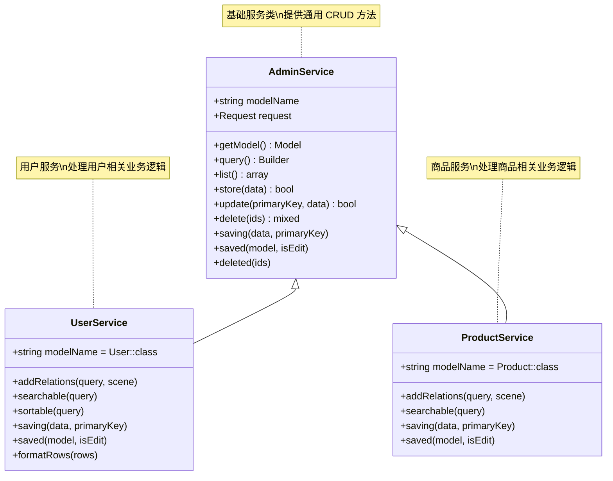

# Service 重写详解

## Service 架构概览

AdminService 是 Owl Admin 框架的核心服务层，提供了完整的 CRUD 操作和扩展机制：



## 核心方法分类

### 主要 CRUD 方法

| 方法 | 说明 | 使用场景 |
|:-----|:-----|:---------|
| `list()` | 获取列表数据 | 列表页面数据查询 |
| `store($data)` | 新增数据 | 创建新记录 |
| `update($primaryKey, $data)` | 修改数据 | 更新现有记录 |
| `delete($ids)` | 删除数据 | 删除单条或多条记录 |

### 查询相关方法

| 方法 | 说明 | 重写频率 |
|:-----|:-----|:---------|
| `listQuery()` | 构建列表查询 | 高 |
| `addRelations($query, $scene)` | 添加关联关系 | 高 |
| `searchable($query)` | 搜索条件 | 高 |
| `sortable($query)` | 排序逻辑 | 中 |
| `sortColumn()` | 默认排序字段 | 中 |

### 数据处理方法

| 方法 | 说明 | 重写频率 |
|:-----|:-----|:---------|
| `formatRows($rows)` | 列表数据格式化 | 高 |
| `getDetail($id)` | 获取详情数据 | 中 |
| `getEditData($id)` | 获取编辑数据 | 中 |

### 钩子方法

| 方法 | 说明 | 执行时机 |
|:-----|:-----|:---------|
| `saving(&$data, $primaryKey)` | 保存前处理 | 新增/修改前 |
| `saved($model, $isEdit)` | 保存后处理 | 新增/修改后 |
| `deleted($ids)` | 删除后处理 | 删除后 |

## 方法详解与实现

### 1. 查询构建方法

#### listQuery() - 构建基础查询

```php
/**
 * 构建列表查询
 *
 * @return Builder
 */
public function listQuery()
{
    $query = $this->query();

    // 添加基础条件
    $query->where('status', '!=', 'deleted');

    // 添加权限过滤
    if (!admin_user()->hasRole('admin')) {
        $query->where('created_by', admin_user()->id);
    }

    // 添加关联关系
    $this->addRelations($query, 'list');

    return $query;
}
```

#### addRelations() - 添加关联关系

```php
/**
 * 添加关联关系
 *
 * @param Builder $query
 * @param string $scene 场景: list, detail, edit
 * @return void
 */
public function addRelations($query, string $scene = 'list')
{
    switch ($scene) {
        case 'list':
            // 列表页面需要的关联
            $query->with([
                'category:id,name',
                'user:id,username,avatar',
                'tags:id,name,color'
            ]);
            break;

        case 'detail':
            // 详情页面需要的关联
            $query->with([
                'category',
                'user.profile',
                'tags',
                'comments.user',
                'attachments'
            ]);
            break;

        case 'edit':
            // 编辑页面需要的关联
            $query->with([
                'category:id,name',
                'tags:id,name',
                'permissions:id,name'
            ]);
            break;
    }
}
```

#### searchable() - 搜索条件

```php
/**
 * 搜索条件
 *
 * @param Builder $query
 * @return void
 */
public function searchable($query)
{
    $keyword = request('keyword');

    if ($keyword) {
        $query->where(function($q) use ($keyword) {
            $q->where('title', 'like', "%{$keyword}%")
              ->orWhere('content', 'like', "%{$keyword}%")
              ->orWhere('description', 'like', "%{$keyword}%")
              ->orWhereHas('user', function($userQuery) use ($keyword) {
                  $userQuery->where('username', 'like', "%{$keyword}%");
              });
        });
    }

    // 分类筛选
    if (request('category_id')) {
        $query->where('category_id', request('category_id'));
    }

    // 状态筛选
    if (request('status') !== null) {
        $query->where('status', request('status'));
    }

    // 日期范围筛选
    if (request('date_range')) {
        $dates = explode(',', request('date_range'));
        if (count($dates) === 2) {
            $query->whereBetween('created_at', [
                $dates[0] . ' 00:00:00',
                $dates[1] . ' 23:59:59'
            ]);
        }
    }

    // 高级搜索
    if (request('advanced_search')) {
        $this->applyAdvancedSearch($query, request('advanced_search'));
    }
}

/**
 * 应用高级搜索
 */
protected function applyAdvancedSearch($query, $conditions)
{
    foreach ($conditions as $condition) {
        $field = $condition['field'] ?? '';
        $operator = $condition['operator'] ?? '=';
        $value = $condition['value'] ?? '';

        if (!$field || $value === '') {
            continue;
        }

        switch ($operator) {
            case 'like':
                $query->where($field, 'like', "%{$value}%");
                break;
            case 'not_like':
                $query->where($field, 'not like', "%{$value}%");
                break;
            case 'in':
                $query->whereIn($field, explode(',', $value));
                break;
            case 'not_in':
                $query->whereNotIn($field, explode(',', $value));
                break;
            case 'between':
                $values = explode(',', $value);
                if (count($values) === 2) {
                    $query->whereBetween($field, $values);
                }
                break;
            default:
                $query->where($field, $operator, $value);
        }
    }
}
```

#### sortable() - 排序逻辑

```php
/**
 * 排序逻辑
 *
 * @param Builder $query
 * @return void
 */
public function sortable($query)
{
    $orderBy = request('orderBy', $this->sortColumn());
    $orderDir = request('orderDir', 'desc');

    // 验证排序字段
    $allowedSortFields = [
        'id', 'title', 'created_at', 'updated_at',
        'status', 'sort', 'view_count'
    ];

    if (!in_array($orderBy, $allowedSortFields)) {
        $orderBy = $this->sortColumn();
    }

    // 验证排序方向
    if (!in_array(strtolower($orderDir), ['asc', 'desc'])) {
        $orderDir = 'desc';
    }

    // 特殊排序处理
    switch ($orderBy) {
        case 'user_name':
            // 关联表排序
            $query->leftJoin('users', 'articles.user_id', '=', 'users.id')
                  ->orderBy('users.username', $orderDir)
                  ->select('articles.*');
            break;

        case 'category_name':
            // 关联表排序
            $query->leftJoin('categories', 'articles.category_id', '=', 'categories.id')
                  ->orderBy('categories.name', $orderDir)
                  ->select('articles.*');
            break;

        default:
            // 普通字段排序
            $query->orderBy($orderBy, $orderDir);
    }

    // 添加二级排序
    if ($orderBy !== 'id') {
        $query->orderBy('id', 'desc');
    }
}

/**
 * 默认排序字段
 *
 * @return string
 */
public function sortColumn(): string
{
    return 'created_at';
}
```

### 2. 数据处理方法

#### formatRows() - 列表数据格式化

```php
/**
 * 列表数据格式化
 *
 * @param array $rows
 * @return array
 */
public function formatRows($rows)
{
    return array_map(function($row) {
        // 格式化日期
        if (isset($row['created_at'])) {
            $row['created_at_formatted'] = date('Y-m-d H:i', strtotime($row['created_at']));
        }

        // 格式化状态
        if (isset($row['status'])) {
            $row['status_text'] = $this->getStatusText($row['status']);
            $row['status_color'] = $this->getStatusColor($row['status']);
        }

        // 格式化用户信息
        if (isset($row['user'])) {
            $row['user_name'] = $row['user']['username'] ?? '';
            $row['user_avatar'] = $row['user']['avatar'] ?? '';
        }

        // 格式化分类信息
        if (isset($row['category'])) {
            $row['category_name'] = $row['category']['name'] ?? '';
        }

        // 格式化标签
        if (isset($row['tags'])) {
            $row['tag_names'] = implode(', ', array_column($row['tags'], 'name'));
            $row['tag_colors'] = array_column($row['tags'], 'color');
        }

        // 格式化文件大小
        if (isset($row['file_size'])) {
            $row['file_size_formatted'] = $this->formatFileSize($row['file_size']);
        }

        // 格式化金额
        if (isset($row['amount'])) {
            $row['amount_formatted'] = number_format($row['amount'], 2);
        }

        // 添加操作权限
        $row['can_edit'] = $this->canEdit($row);
        $row['can_delete'] = $this->canDelete($row);

        return $row;
    }, $rows);
}

/**
 * 获取状态文本
 */
protected function getStatusText($status)
{
    $statusMap = [
        0 => '禁用',
        1 => '启用',
        2 => '待审核',
        3 => '已拒绝',
    ];

    return $statusMap[$status] ?? '未知';
}

/**
 * 获取状态颜色
 */
protected function getStatusColor($status)
{
    $colorMap = [
        0 => 'danger',
        1 => 'success',
        2 => 'warning',
        3 => 'secondary',
    ];

    return $colorMap[$status] ?? 'secondary';
}

/**
 * 格式化文件大小
 */
protected function formatFileSize($bytes)
{
    $units = ['B', 'KB', 'MB', 'GB', 'TB'];

    for ($i = 0; $bytes > 1024 && $i < count($units) - 1; $i++) {
        $bytes /= 1024;
    }

    return round($bytes, 2) . ' ' . $units[$i];
}
```

#### getDetail() - 获取详情数据

```php
/**
 * 获取详情数据
 *
 * @param mixed $id
 * @return Model
 */
public function getDetail($id)
{
    $query = $this->query();

    // 添加详情页面需要的关联
    $this->addRelations($query, 'detail');

    $model = $query->findOrFail($id);

    // 增加浏览次数
    $this->incrementViewCount($model);

    // 格式化详情数据
    return $this->formatDetailData($model);
}

/**
 * 格式化详情数据
 */
protected function formatDetailData($model)
{
    // 处理富文本内容
    if ($model->content) {
        $model->content_html = $this->processRichText($model->content);
    }

    // 处理附件
    if ($model->attachments) {
        $model->attachment_list = $model->attachments->map(function($attachment) {
            return [
                'id' => $attachment->id,
                'name' => $attachment->name,
                'url' => $attachment->url,
                'size' => $this->formatFileSize($attachment->size),
                'type' => $attachment->type,
            ];
        });
    }

    // 处理相关推荐
    $model->related_items = $this->getRelatedItems($model);

    return $model;
}

/**
 * 增加浏览次数
 */
protected function incrementViewCount($model)
{
    if (method_exists($model, 'increment')) {
        $model->increment('view_count');
    }
}
```

#### getEditData() - 获取编辑数据

```php
/**
 * 获取编辑数据
 *
 * @param mixed $id
 * @return Model
 */
public function getEditData($id)
{
    $query = $this->query();

    // 添加编辑页面需要的关联
    $this->addRelations($query, 'edit');

    $model = $query->findOrFail($id);

    // 格式化编辑数据
    return $this->formatEditData($model);
}

/**
 * 格式化编辑数据
 */
protected function formatEditData($model)
{
    // 处理多选关联数据
    if ($model->relationLoaded('tags')) {
        $model->tag_ids = $model->tags->pluck('id')->toArray();
    }

    if ($model->relationLoaded('permissions')) {
        $model->permission_ids = $model->permissions->pluck('id')->toArray();
    }

    // 处理日期格式
    $dateFields = ['publish_at', 'expire_at', 'birthday'];
    foreach ($dateFields as $field) {
        if ($model->$field) {
            $model->$field = $model->$field->format('Y-m-d H:i:s');
        }
    }

    // 处理 JSON 字段
    if ($model->settings) {
        $model->settings = json_decode($model->settings, true);
    }

    // 移除敏感字段
    $model->makeHidden(['password', 'remember_token']);

    return $model;
}
```

### 3. 钩子方法详解

#### saving() - 保存前处理

```php
/**
 * 保存前处理
 *
 * @param array $data 表单数据（引用传递，可修改）
 * @param string $primaryKey 主键值（空表示新增）
 * @return void
 */
public function saving(&$data, $primaryKey = '')
{
    $isEdit = !empty($primaryKey);

    // 数据验证
    $this->validateData($data, $isEdit);

    // 密码处理
    if (isset($data['password'])) {
        if ($isEdit && empty($data['password'])) {
            // 编辑时密码为空则不更新
            unset($data['password']);
        } else {
            // 加密密码
            $data['password'] = Hash::make($data['password']);
        }
    }

    // 处理上传文件
    $this->handleFileUploads($data, $primaryKey);

    // 处理 JSON 字段
    if (isset($data['settings']) && is_array($data['settings'])) {
        $data['settings'] = json_encode($data['settings']);
    }

    // 生成唯一标识
    if (!$isEdit && !isset($data['uuid'])) {
        $data['uuid'] = Str::uuid();
    }

    // 生成 slug
    if (isset($data['title']) && !isset($data['slug'])) {
        $data['slug'] = $this->generateSlug($data['title'], $primaryKey);
    }

    // 设置创建者/更新者
    if (!$isEdit) {
        $data['created_by'] = admin_user()->id;
    } else {
        $data['updated_by'] = admin_user()->id;
    }

    // 处理状态变更
    if ($isEdit && isset($data['status'])) {
        $oldModel = $this->query()->find($primaryKey);
        if ($oldModel && $oldModel->status !== $data['status']) {
            $data['status_changed_at'] = now();
            $data['status_changed_by'] = admin_user()->id;
        }
    }

    // 业务逻辑处理
    $this->handleBusinessLogic($data, $isEdit);
}

/**
 * 数据验证
 */
protected function validateData($data, $isEdit = false)
{
    $rules = [
        'title' => 'required|max:255',
        'email' => 'required|email|unique:users,email' . ($isEdit ? ',' . $data['id'] : ''),
    ];

    if (!$isEdit) {
        $rules['password'] = 'required|min:6';
    }

    $validator = validator($data, $rules);

    if ($validator->fails()) {
        admin_abort($validator->errors()->first());
    }
}

/**
 * 处理文件上传
 */
protected function handleFileUploads(&$data, $primaryKey = '')
{
    $fileFields = ['avatar', 'cover', 'attachments'];

    foreach ($fileFields as $field) {
        if (!isset($data[$field])) {
            continue;
        }

        if (is_string($data[$field])) {
            // 单文件处理
            $data[$field] = $this->processUploadedFile($data[$field], $primaryKey, $field);
        } elseif (is_array($data[$field])) {
            // 多文件处理
            $data[$field] = array_map(function($file) use ($primaryKey, $field) {
                return $this->processUploadedFile($file, $primaryKey, $field);
            }, $data[$field]);
        }
    }
}

/**
 * 处理单个上传文件
 */
protected function processUploadedFile($file, $primaryKey, $field)
{
    // 如果是编辑模式，删除旧文件
    if ($primaryKey) {
        $oldModel = $this->query()->find($primaryKey);
        if ($oldModel && $oldModel->$field && $oldModel->$field !== $file) {
            Storage::delete($oldModel->$field);
        }
    }

    // 处理新文件
    if (Str::startsWith($file, 'temp/')) {
        // 从临时目录移动到正式目录
        $newPath = str_replace('temp/', 'uploads/', $file);
        Storage::move($file, $newPath);
        return $newPath;
    }

    return $file;
}

/**
 * 生成唯一 slug
 */
protected function generateSlug($title, $excludeId = null)
{
    $slug = Str::slug($title);
    $originalSlug = $slug;
    $counter = 1;

    while ($this->slugExists($slug, $excludeId)) {
        $slug = $originalSlug . '-' . $counter;
        $counter++;
    }

    return $slug;
}

/**
 * 检查 slug 是否存在
 */
protected function slugExists($slug, $excludeId = null)
{
    $query = $this->query()->where('slug', $slug);

    if ($excludeId) {
        $query->where('id', '!=', $excludeId);
    }

    return $query->exists();
}
```

#### saved() - 保存后处理

```php
/**
 * 保存后处理
 *
 * @param Model $model 保存后的模型实例
 * @param bool $isEdit 是否为编辑操作
 * @return void
 */
public function saved($model, $isEdit = false)
{
    // 处理关联数据
    $this->handleRelationships($model, $isEdit);

    // 清理缓存
    $this->clearRelatedCache($model);

    // 记录操作日志
    $this->logOperation($model, $isEdit);

    // 发送通知
    $this->sendNotifications($model, $isEdit);

    // 处理搜索索引
    $this->updateSearchIndex($model, $isEdit);

    // 触发事件
    $this->triggerEvents($model, $isEdit);
}

/**
 * 处理关联数据
 */
protected function handleRelationships($model, $isEdit)
{
    // 同步标签关联
    if (isset($this->request['tag_ids'])) {
        $model->tags()->sync($this->request['tag_ids']);
    }

    // 同步权限关联
    if (isset($this->request['permission_ids'])) {
        $model->permissions()->sync($this->request['permission_ids']);
    }

    // 同步角色关联
    if (isset($this->request['role_ids'])) {
        $model->roles()->sync($this->request['role_ids']);
    }

    // 处理附件关联
    if (isset($this->request['attachment_ids'])) {
        $model->attachments()->sync($this->request['attachment_ids']);
    }

    // 处理分类关联（多对多）
    if (isset($this->request['category_ids'])) {
        $model->categories()->sync($this->request['category_ids']);
    }
}

/**
 * 清理相关缓存
 */
protected function clearRelatedCache($model)
{
    $cacheKeys = [
        "model_{$model->id}",
        "user_permissions_{$model->id}",
        "category_products_{$model->category_id}",
        "user_statistics",
        "popular_articles",
    ];

    foreach ($cacheKeys as $key) {
        cache()->forget($key);
    }

    // 清理标签缓存
    cache()->tags(['articles', 'users'])->flush();
}

/**
 * 记录操作日志
 */
protected function logOperation($model, $isEdit)
{
    $action = $isEdit ? '更新' : '创建';

    logger()->info("{$action}记录", [
        'model' => get_class($model),
        'id' => $model->getKey(),
        'title' => $model->title ?? $model->name ?? '',
        'operator' => admin_user()->username,
        'changes' => $isEdit ? $model->getChanges() : null,
    ]);
}

/**
 * 发送通知
 */
protected function sendNotifications($model, $isEdit)
{
    if (!$isEdit) {
        // 新增通知
        event(new ModelCreated($model));

        // 通知相关用户
        if ($model instanceof Article) {
            // 通知关注者
            $this->notifyFollowers($model);
        }
    } else {
        // 更新通知
        event(new ModelUpdated($model));

        // 状态变更通知
        if ($model->wasChanged('status')) {
            event(new StatusChanged($model));
        }
    }
}

/**
 * 更新搜索索引
 */
protected function updateSearchIndex($model, $isEdit)
{
    // 如果使用了搜索引擎（如 Elasticsearch）
    if (class_exists('Laravel\Scout\Searchable') && in_array('Laravel\Scout\Searchable', class_uses($model))) {
        $model->searchable();
    }

    // 自定义搜索索引更新
    dispatch(new UpdateSearchIndex($model));
}

/**
 * 触发事件
 */
protected function triggerEvents($model, $isEdit)
{
    if ($isEdit) {
        event(new ModelUpdated($model));
    } else {
        event(new ModelCreated($model));
    }
}
```

#### deleted() - 删除后处理

```php
/**
 * 删除后处理
 *
 * @param array $ids 删除的ID数组
 * @return void
 */
public function deleted($ids)
{
    // 获取被删除的模型（软删除情况下）
    $models = $this->query()->withTrashed()->whereIn($this->primaryKey(), $ids)->get();

    foreach ($models as $model) {
        // 清理关联数据
        $this->cleanupRelatedData($model);

        // 清理文件
        $this->cleanupFiles($model);

        // 清理缓存
        $this->clearModelCache($model);

        // 记录删除日志
        $this->logDeletion($model);

        // 发送删除通知
        $this->sendDeletionNotification($model);
    }

    // 更新统计数据
    $this->updateStatistics();
}

/**
 * 清理关联数据
 */
protected function cleanupRelatedData($model)
{
    // 删除关联的标签
    if (method_exists($model, 'tags')) {
        $model->tags()->detach();
    }

    // 删除关联的评论
    if (method_exists($model, 'comments')) {
        $model->comments()->delete();
    }

    // 删除关联的收藏
    if (method_exists($model, 'favorites')) {
        $model->favorites()->delete();
    }

    // 删除关联的通知
    if (method_exists($model, 'notifications')) {
        $model->notifications()->delete();
    }
}

/**
 * 清理文件
 */
protected function cleanupFiles($model)
{
    $fileFields = ['avatar', 'cover', 'attachments'];

    foreach ($fileFields as $field) {
        if (isset($model->$field) && $model->$field) {
            if (is_array($model->$field)) {
                foreach ($model->$field as $file) {
                    Storage::delete($file);
                }
            } else {
                Storage::delete($model->$field);
            }
        }
    }
}

/**
 * 清理模型缓存
 */
protected function clearModelCache($model)
{
    $cacheKeys = [
        "model_{$model->id}",
        "user_permissions_{$model->id}",
        "article_views_{$model->id}",
    ];

    foreach ($cacheKeys as $key) {
        cache()->forget($key);
    }
}

/**
 * 记录删除日志
 */
protected function logDeletion($model)
{
    logger()->info('删除记录', [
        'model' => get_class($model),
        'id' => $model->getKey(),
        'title' => $model->title ?? $model->name ?? '',
        'operator' => admin_user()->username,
        'deleted_at' => now(),
    ]);
}
```

## 完整实际应用案例

### 1. 用户管理 Service

```php
<?php

namespace App\Admin\Services;

use App\Models\User;
use Illuminate\Support\Facades\Hash;
use Illuminate\Support\Facades\Storage;
use Slowlyo\OwlAdmin\Services\AdminService;

class UserService extends AdminService
{
    protected string $modelName = User::class;

    /**
     * 构建列表查询
     */
    public function listQuery()
    {
        $query = $this->query();

        // 排除软删除的用户
        $query->whereNull('deleted_at');

        // 非超级管理员只能看到自己创建的用户
        if (!admin_user()->hasRole('super-admin')) {
            $query->where('created_by', admin_user()->id);
        }

        $this->addRelations($query, 'list');

        return $query;
    }

    /**
     * 添加关联关系
     */
    public function addRelations($query, string $scene = 'list')
    {
        switch ($scene) {
            case 'list':
                $query->with([
                    'roles:id,name,display_name',
                    'department:id,name',
                    'creator:id,username'
                ]);
                break;

            case 'detail':
                $query->with([
                    'roles.permissions',
                    'department.parent',
                    'profile',
                    'loginLogs' => function($q) {
                        $q->latest()->limit(10);
                    }
                ]);
                break;

            case 'edit':
                $query->with(['roles:id,name', 'department:id,name']);
                break;
        }
    }

    /**
     * 搜索条件
     */
    public function searchable($query)
    {
        // 关键词搜索
        if ($keyword = request('keyword')) {
            $query->where(function($q) use ($keyword) {
                $q->where('username', 'like', "%{$keyword}%")
                  ->orWhere('email', 'like', "%{$keyword}%")
                  ->orWhere('real_name', 'like', "%{$keyword}%")
                  ->orWhere('phone', 'like', "%{$keyword}%");
            });
        }

        // 部门筛选
        if ($departmentId = request('department_id')) {
            $query->where('department_id', $departmentId);
        }

        // 角色筛选
        if ($roleId = request('role_id')) {
            $query->whereHas('roles', function($q) use ($roleId) {
                $q->where('roles.id', $roleId);
            });
        }

        // 状态筛选
        if (request('status') !== null) {
            $query->where('status', request('status'));
        }

        // 注册时间筛选
        if ($dateRange = request('created_at_range')) {
            $dates = explode(' - ', $dateRange);
            if (count($dates) === 2) {
                $query->whereBetween('created_at', [
                    $dates[0] . ' 00:00:00',
                    $dates[1] . ' 23:59:59'
                ]);
            }
        }
    }

    /**
     * 排序逻辑
     */
    public function sortable($query)
    {
        $orderBy = request('orderBy', 'created_at');
        $orderDir = request('orderDir', 'desc');

        switch ($orderBy) {
            case 'department_name':
                $query->leftJoin('departments', 'users.department_id', '=', 'departments.id')
                      ->orderBy('departments.name', $orderDir)
                      ->select('users.*');
                break;

            case 'role_name':
                $query->leftJoin('model_has_roles', 'users.id', '=', 'model_has_roles.model_id')
                      ->leftJoin('roles', 'model_has_roles.role_id', '=', 'roles.id')
                      ->orderBy('roles.name', $orderDir)
                      ->select('users.*')
                      ->distinct();
                break;

            default:
                $query->orderBy($orderBy, $orderDir);
        }
    }

    /**
     * 保存前处理
     */
    public function saving(&$data, $primaryKey = '')
    {
        $isEdit = !empty($primaryKey);

        // 验证数据
        $this->validateUserData($data, $isEdit);

        // 处理密码
        if (isset($data['password'])) {
            if ($isEdit && empty($data['password'])) {
                unset($data['password']);
            } else {
                $data['password'] = Hash::make($data['password']);
            }
        }

        // 处理头像上传
        if (isset($data['avatar']) && $data['avatar']) {
            $data['avatar'] = $this->handleAvatarUpload($data['avatar'], $primaryKey);
        }

        // 生成用户名（如果未提供）
        if (!$isEdit && empty($data['username'])) {
            $data['username'] = $this->generateUsername($data['email']);
        }

        // 设置创建者
        if (!$isEdit) {
            $data['created_by'] = admin_user()->id;
        }

        // 处理员工编号
        if (!$isEdit && empty($data['employee_id'])) {
            $data['employee_id'] = $this->generateEmployeeId();
        }
    }

    /**
     * 验证用户数据
     */
    protected function validateUserData($data, $isEdit = false)
    {
        $rules = [
            'email' => 'required|email|unique:users,email' . ($isEdit ? ',' . $data['id'] : ''),
            'real_name' => 'required|max:50',
            'phone' => 'nullable|regex:/^1[3-9]\d{9}$/|unique:users,phone' . ($isEdit ? ',' . $data['id'] : ''),
        ];

        if (!$isEdit) {
            $rules['password'] = 'required|min:6|max:20';
        }

        $validator = validator($data, $rules, [
            'email.required' => '邮箱不能为空',
            'email.email' => '邮箱格式不正确',
            'email.unique' => '邮箱已存在',
            'real_name.required' => '真实姓名不能为空',
            'phone.regex' => '手机号格式不正确',
            'phone.unique' => '手机号已存在',
            'password.required' => '密码不能为空',
            'password.min' => '密码至少6位',
        ]);

        if ($validator->fails()) {
            admin_abort($validator->errors()->first());
        }
    }

    /**
     * 处理头像上传
     */
    protected function handleAvatarUpload($avatar, $primaryKey = '')
    {
        // 删除旧头像
        if ($primaryKey) {
            $oldUser = $this->query()->find($primaryKey);
            if ($oldUser && $oldUser->avatar && $oldUser->avatar !== $avatar) {
                Storage::delete($oldUser->avatar);
            }
        }

        // 处理新头像
        if (Str::startsWith($avatar, 'temp/')) {
            $newPath = 'avatars/' . date('Y/m/') . basename($avatar);
            Storage::move($avatar, $newPath);
            return $newPath;
        }

        return $avatar;
    }

    /**
     * 生成用户名
     */
    protected function generateUsername($email)
    {
        $username = explode('@', $email)[0];
        $originalUsername = $username;
        $counter = 1;

        while ($this->query()->where('username', $username)->exists()) {
            $username = $originalUsername . $counter;
            $counter++;
        }

        return $username;
    }

    /**
     * 生成员工编号
     */
    protected function generateEmployeeId()
    {
        $prefix = 'EMP';
        $date = date('Ymd');
        $lastEmployee = $this->query()
            ->where('employee_id', 'like', $prefix . $date . '%')
            ->orderBy('employee_id', 'desc')
            ->first();

        if ($lastEmployee) {
            $lastNumber = intval(substr($lastEmployee->employee_id, -4));
            $newNumber = $lastNumber + 1;
        } else {
            $newNumber = 1;
        }

        return $prefix . $date . str_pad($newNumber, 4, '0', STR_PAD_LEFT);
    }

    /**
     * 保存后处理
     */
    public function saved($model, $isEdit = false)
    {
        // 同步角色
        if (isset($this->request['role_ids'])) {
            $model->syncRoles($this->request['role_ids']);
        }

        // 创建用户档案
        if (!$isEdit) {
            $model->profile()->create([
                'nickname' => $model->real_name,
                'gender' => $this->request['gender'] ?? 0,
                'birthday' => $this->request['birthday'] ?? null,
            ]);
        }

        // 清理权限缓存
        cache()->forget("user_permissions_{$model->id}");
        cache()->forget("user_roles_{$model->id}");

        // 记录操作日志
        logger()->info($isEdit ? '更新用户' : '创建用户', [
            'user_id' => $model->id,
            'username' => $model->username,
            'real_name' => $model->real_name,
            'operator' => admin_user()->username,
        ]);

        // 发送通知邮件
        if (!$isEdit && isset($this->request['send_welcome_email'])) {
            dispatch(new SendWelcomeEmail($model));
        }
    }

    /**
     * 列表数据格式化
     */
    public function formatRows($rows)
    {
        return array_map(function($row) {
            // 格式化状态
            $row['status_text'] = $row['status'] ? '启用' : '禁用';
            $row['status_color'] = $row['status'] ? 'success' : 'danger';

            // 格式化角色
            if (isset($row['roles'])) {
                $row['role_names'] = implode(', ', array_column($row['roles'], 'display_name'));
            }

            // 格式化部门
            if (isset($row['department'])) {
                $row['department_name'] = $row['department']['name'] ?? '';
            }

            // 格式化创建时间
            $row['created_at_formatted'] = date('Y-m-d H:i', strtotime($row['created_at']));

            // 格式化最后登录时间
            if ($row['last_login_at']) {
                $row['last_login_at_formatted'] = date('Y-m-d H:i', strtotime($row['last_login_at']));
            } else {
                $row['last_login_at_formatted'] = '从未登录';
            }

            // 添加操作权限
            $row['can_edit'] = admin_user()->can('update', User::class);
            $row['can_delete'] = admin_user()->can('delete', User::class) && $row['id'] !== admin_user()->id;

            return $row;
        }, $rows);
    }

    /**
     * 删除后处理
     */
    public function deleted($ids)
    {
        $users = $this->query()->withTrashed()->whereIn('id', $ids)->get();

        foreach ($users as $user) {
            // 删除头像文件
            if ($user->avatar) {
                Storage::delete($user->avatar);
            }

            // 清理会话
            $user->sessions()->delete();

            // 撤销所有角色
            $user->roles()->detach();

            // 清理权限缓存
            cache()->forget("user_permissions_{$user->id}");

            // 记录删除日志
            logger()->info('删除用户', [
                'user_id' => $user->id,
                'username' => $user->username,
                'operator' => admin_user()->username,
            ]);
        }
    }
}
```

### 2. 文章管理 Service

```php
<?php

namespace App\Admin\Services;

use App\Models\Article;
use Illuminate\Support\Str;
use Illuminate\Support\Facades\Storage;
use Slowlyo\OwlAdmin\Services\AdminService;

class ArticleService extends AdminService
{
    protected string $modelName = Article::class;

    public function listQuery()
    {
        $query = $this->query();

        // 根据用户权限过滤
        if (!admin_user()->hasRole('admin')) {
            $query->where('author_id', admin_user()->id);
        }

        $this->addRelations($query, 'list');

        return $query;
    }

    public function addRelations($query, string $scene = 'list')
    {
        switch ($scene) {
            case 'list':
                $query->with([
                    'category:id,name,color',
                    'author:id,username,real_name,avatar',
                    'tags:id,name,color'
                ]);
                break;

            case 'detail':
                $query->with([
                    'category',
                    'author.profile',
                    'tags',
                    'comments' => function($q) {
                        $q->with('user:id,username,avatar')->latest();
                    }
                ]);
                break;
        }
    }

    public function searchable($query)
    {
        if ($keyword = request('keyword')) {
            $query->where(function($q) use ($keyword) {
                $q->where('title', 'like', "%{$keyword}%")
                  ->orWhere('summary', 'like', "%{$keyword}%")
                  ->orWhere('content', 'like', "%{$keyword}%");
            });
        }

        if ($categoryId = request('category_id')) {
            $query->where('category_id', $categoryId);
        }

        if ($status = request('status')) {
            $query->where('status', $status);
        }

        if ($tagId = request('tag_id')) {
            $query->whereHas('tags', function($q) use ($tagId) {
                $q->where('tags.id', $tagId);
            });
        }
    }

    public function saving(&$data, $primaryKey = '')
    {
        $isEdit = !empty($primaryKey);

        // 生成摘要
        if (empty($data['summary']) && !empty($data['content'])) {
            $data['summary'] = Str::limit(strip_tags($data['content']), 200);
        }

        // 生成 slug
        if (empty($data['slug'])) {
            $data['slug'] = $this->generateSlug($data['title'], $primaryKey);
        }

        // 处理封面图片
        if (isset($data['cover']) && $data['cover']) {
            $data['cover'] = $this->handleCoverUpload($data['cover'], $primaryKey);
        }

        // 设置作者
        if (!$isEdit) {
            $data['author_id'] = admin_user()->id;
        }

        // 处理发布时间
        if ($data['status'] === 'published' && empty($data['published_at'])) {
            $data['published_at'] = now();
        }

        // 统计字数
        if (isset($data['content'])) {
            $data['word_count'] = mb_strlen(strip_tags($data['content']));
        }
    }

    public function saved($model, $isEdit = false)
    {
        // 同步标签
        if (isset($this->request['tag_ids'])) {
            $model->tags()->sync($this->request['tag_ids']);
        }

        // 处理 SEO 信息
        if (isset($this->request['seo'])) {
            $model->seo()->updateOrCreate(
                ['article_id' => $model->id],
                $this->request['seo']
            );
        }

        // 更新分类文章数
        if ($model->category) {
            $model->category->updateArticleCount();
        }

        // 清理缓存
        cache()->forget("article_{$model->id}");
        cache()->forget("popular_articles");
        cache()->forget("latest_articles");

        // 更新搜索索引
        if ($model->status === 'published') {
            dispatch(new UpdateSearchIndex($model));
        }
    }

    public function formatRows($rows)
    {
        return array_map(function($row) {
            // 格式化状态
            $statusMap = [
                'draft' => ['text' => '草稿', 'color' => 'secondary'],
                'published' => ['text' => '已发布', 'color' => 'success'],
                'pending' => ['text' => '待审核', 'color' => 'warning'],
                'rejected' => ['text' => '已拒绝', 'color' => 'danger'],
            ];

            $status = $statusMap[$row['status']] ?? ['text' => '未知', 'color' => 'secondary'];
            $row['status_text'] = $status['text'];
            $row['status_color'] = $status['color'];

            // 格式化分类
            if (isset($row['category'])) {
                $row['category_name'] = $row['category']['name'];
                $row['category_color'] = $row['category']['color'] ?? '#007bff';
            }

            // 格式化作者
            if (isset($row['author'])) {
                $row['author_name'] = $row['author']['real_name'] ?: $row['author']['username'];
            }

            // 格式化标签
            if (isset($row['tags'])) {
                $row['tag_names'] = implode(', ', array_column($row['tags'], 'name'));
            }

            // 格式化时间
            $row['created_at_formatted'] = date('Y-m-d H:i', strtotime($row['created_at']));

            if ($row['published_at']) {
                $row['published_at_formatted'] = date('Y-m-d H:i', strtotime($row['published_at']));
            }

            return $row;
        }, $rows);
    }

    protected function generateSlug($title, $excludeId = null)
    {
        $slug = Str::slug($title);
        $originalSlug = $slug;
        $counter = 1;

        while ($this->slugExists($slug, $excludeId)) {
            $slug = $originalSlug . '-' . $counter;
            $counter++;
        }

        return $slug;
    }

    protected function slugExists($slug, $excludeId = null)
    {
        $query = $this->query()->where('slug', $slug);

        if ($excludeId) {
            $query->where('id', '!=', $excludeId);
        }

        return $query->exists();
    }

    protected function handleCoverUpload($cover, $primaryKey = '')
    {
        if ($primaryKey) {
            $oldArticle = $this->query()->find($primaryKey);
            if ($oldArticle && $oldArticle->cover && $oldArticle->cover !== $cover) {
                Storage::delete($oldArticle->cover);
            }
        }

        if (Str::startsWith($cover, 'temp/')) {
            $newPath = 'covers/' . date('Y/m/') . basename($cover);
            Storage::move($cover, $newPath);
            return $newPath;
        }

        return $cover;
    }
}
```

## 最佳实践总结

### 1. 方法重写原则

- **保持原有逻辑**：重写 `searchable()` 和 `sortable()` 时要保留原方法的核心逻辑
- **数据验证**：在 `saving()` 中进行严格的数据验证
- **关联处理**：在 `saved()` 中处理复杂的关联关系
- **缓存清理**：及时清理相关缓存，保证数据一致性

### 2. 性能优化

- **预加载关联**：在 `addRelations()` 中合理使用 `with()` 预加载
- **查询优化**：避免 N+1 查询问题
- **索引使用**：确保搜索和排序字段有适当的数据库索引
- **分页处理**：大数据量时使用游标分页

### 3. 安全考虑

- **权限控制**：在查询中加入权限过滤
- **数据验证**：严格验证用户输入
- **SQL 注入防护**：使用参数化查询
- **文件上传安全**：验证文件类型和大小

### 4. 代码组织

- **单一职责**：每个方法只负责一个功能
- **可读性**：使用清晰的变量名和注释
- **可测试性**：将复杂逻辑拆分为小方法
- **可扩展性**：预留扩展点，便于后续功能添加