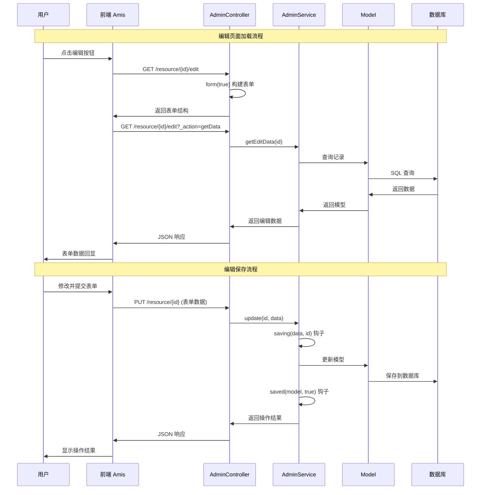

# 编辑功能详解

## 编辑流程概览

编辑功能包括数据回显、表单验证、数据更新等核心环节：



## 表单构建与数据回显

### form 方法的编辑模式

`form` 方法通过 `$isEdit` 参数区分新增和编辑模式：

```php
/**
 * 构建表单结构
 *
 * @param bool $isEdit 是否为编辑模式
 * @return \Slowlyo\OwlAdmin\Renderers\Form
 */
public function form($isEdit = false)
{
    // 注意：baseForm 的参数用于控制“提交成功后返回上一页”，与是否编辑无关
    return $this->baseForm()->body([
        // 基础信息分组
        amis()->GroupControl()->label('基础信息')->body([
            amis()->TextControl('title', '标题')
                ->required()
                ->maxLength(100)
                ->placeholder('请输入标题'),

            // 编辑时显示 ID（只读）
            amis()->StaticExactControl('id', 'ID')
                ->visibleOn('${id}'), // 仅编辑时显示

            amis()->SelectControl('category_id', '分类')
                ->required()
                ->source('/api/categories')
                ->placeholder('请选择分类'),
        ]),

        // 密码字段（仅新增时必填）
        amis()->GroupControl()
            ->label('密码设置')
            ->visibleOn('!${id}') // 仅新增时显示
            ->body([
                amis()->PasswordControl('password', '密码')
                    ->required()
                    ->minLength(6)
                    ->placeholder('请输入密码'),
            ]),

        // 密码修改（仅编辑时显示）
        amis()->GroupControl()
            ->label('修改密码')
            ->visibleOn('${id}') // 仅编辑时显示
            ->body([
                amis()->PasswordControl('new_password', '新密码')
                    ->minLength(6)
                    ->placeholder('留空则不修改密码'),

                amis()->PasswordControl('confirm_password', '确认密码')
                    ->validations(['equalsField' => 'new_password'])
                    ->visibleOn('${new_password}'), // 仅输入新密码时显示
            ]),

        // 状态信息
        amis()->GroupControl()->label('状态信息')->body([
            amis()->SwitchControl('status', '状态')
                ->value(1)
                ->onText('启用')
                ->offText('禁用'),

            // 编辑时显示创建信息
            amis()->StaticExactControl('created_at', '创建时间')
                ->type('datetime')
                ->visibleOn('${id}'),

            amis()->StaticExactControl('updated_at', '更新时间')
                ->type('datetime')
                ->visibleOn('${id}'),
        ]),
    ]);
}
```

提示：如需在提交成功后返回上一页，可使用 `baseForm(true)` 开启“提交成功后返回上一页”的行为，该参数与 `$isEdit` 无关。

### 条件显示字段

根据编辑状态动态显示不同字段：

```php
// 仅新增时显示
amis()->TextControl('username', '用户名')
    ->required()
    ->visibleOn('!${id}'),

// 仅编辑时显示
amis()->StaticExactControl('username', '用户名')
    ->visibleOn('${id}'),

// 根据状态显示
amis()->TextControl('reason', '禁用原因')
    ->visibleOn('${status == 0}'),

// 根据角色显示
amis()->SelectControl('department_id', '部门')
    ->visibleOn('${role == "employee"}')
    ->source('/api/departments'),
```

### 数据回显机制

#### edit 方法处理

```php
/**
 * 编辑页面处理
 *
 * @param mixed $id
 * @return JsonResponse|JsonResource
 */
public function edit($id)
{
    $this->isEdit = true;

    // 获取编辑数据
    if ($this->actionOfGetData()) {
        return $this->response()->success($this->service->getEditData($id));
    }

    // 构建编辑页面
    $form = amis()->Card()
        ->className('base-form')
        ->header(['title' => admin_trans('admin.edit')])
        ->body(
            $this->form(true)
                ->api($this->getUpdatePath())
                ->initApi($this->getEditGetDataPath())
        ) // 传入 true 表示编辑模式
        ->toolbar([$this->backButton()]);

    $page = $this->basePage()->body($form);

    return $this->response()->success($page);
}
```

#### getEditData 方法实现

```php
/**
 * 获取编辑数据
 *
 * @param mixed $id
 * @return Model
 */
public function getEditData($id)
{
    $query = $this->query();

    // 添加关联关系
    $this->addRelations($query, 'edit');

    $model = $query->find($id);

    if (!$model) {
        admin_abort('记录不存在');
    }

    // 数据预处理
    return $this->formatEditData($model);
}

/**
 * 格式化编辑数据
 *
 * @param Model $model
 * @return Model
 */
protected function formatEditData($model)
{
    // 处理关联数据
    if ($model->relationLoaded('tags')) {
        $model->tag_ids = $model->tags->pluck('id')->toArray();
    }

    // 处理日期格式
    if ($model->publish_at) {
        $model->publish_at = $model->publish_at->format('Y-m-d H:i:s');
    }

    // 处理 JSON 字段
    if ($model->settings) {
        $model->settings = json_decode($model->settings, true);
    }

    // 移除敏感字段
    unset($model->password);

    return $model;
}
```

## 数据更新处理

### update 方法流程

控制器的 `update` 方法处理编辑请求：

```php
/**
 * 编辑保存
 *
 * @param Request $request
 * @return JsonResponse|JsonResource
 */
public function update(Request $request)
{
    $primaryKey = $this->getPrimaryValue($request);
    $result = $this->service->update($primaryKey, $request->all());

    return $this->autoResponse($result, admin_trans('admin.save'));
}
```

### Service 层更新实现

```php
/**
 * 更新数据
 *
 * @param mixed $primaryKey
 * @param array $data
 * @return bool
 */
public function update($primaryKey, $data): bool
{
    DB::beginTransaction();
    try {
        // 查找记录
        $model = $this->query()->findOrFail($primaryKey);

        // 保存前钩子
        $this->saving($data, $primaryKey);

        // 更新字段
        foreach ($data as $k => $v) {
            if (!$this->hasColumn($k)) {
                continue;
            }
            $model->setAttribute($k, $v);
        }

        $result = $model->save();

        if ($result) {
            // 保存后钩子
            $this->saved($model, true);
        }

        DB::commit();
        return $result;

    } catch (\Throwable $e) {
        DB::rollBack();
        admin_abort($e->getMessage());
    }
}
```

### 编辑钩子函数

#### saving 钩子（更新前）

```php
/**
 * 保存前处理
 *
 * @param array $data 表单数据
 * @param string $primaryKey 主键值
 */
public function saving(&$data, $primaryKey = '')
{
    // 密码处理
    if (isset($data['new_password']) && $data['new_password']) {
        $data['password'] = Hash::make($data['new_password']);
    }
    unset($data['new_password'], $data['confirm_password']);

    // 更新者信息
    if ($primaryKey) {
        $data['updated_by'] = admin_user()->id;
        $data['updated_at'] = now();
    }

    // 处理上传文件
    if (isset($data['avatar']) && is_string($data['avatar'])) {
        $oldModel = $this->query()->find($primaryKey);
        if ($oldModel && $oldModel->avatar !== $data['avatar']) {
            // 删除旧文件
            $this->deleteOldFile($oldModel->avatar);
            // 处理新文件
            $data['avatar'] = $this->processUploadedFile($data['avatar']);
        }
    }

    // 数据验证
    $this->validateUpdateData($data, $primaryKey);
}

/**
 * 编辑数据验证
 */
private function validateUpdateData($data, $primaryKey)
{
    $rules = [
        'title' => 'required|max:100',
        'email' => 'required|email|unique:users,email,' . $primaryKey,
    ];

    // 密码验证（仅在修改时）
    if (isset($data['new_password'])) {
        $rules['new_password'] = 'min:6';
        $rules['confirm_password'] = 'same:new_password';
    }

    $validator = validator($data, $rules);

    if ($validator->fails()) {
        admin_abort($validator->errors()->first());
    }
}
```

#### saved 钩子（更新后）

```php
/**
 * 保存后处理
 *
 * @param Model $model 模型实例
 * @param bool $isEdit 是否为编辑
 */
public function saved($model, $isEdit = false)
{
    if ($isEdit) {
        // 处理关联数据更新
        if (isset($this->request['tag_ids'])) {
            $model->tags()->sync($this->request['tag_ids']);
        }

        // 清除相关缓存
        cache()->forget("user_{$model->id}");
        cache()->forget("user_permissions_{$model->id}");

        // 记录变更日志
        $this->logChanges($model);

        // 发送通知
        if ($model->wasChanged('status')) {
            event(new UserStatusChanged($model));
        }
    }
}

/**
 * 记录变更日志
 */
private function logChanges($model)
{
    $changes = $model->getChanges();
    $original = $model->getOriginal();

    $changeLog = [];
    foreach ($changes as $field => $newValue) {
        $oldValue = $original[$field] ?? null;
        $changeLog[] = [
            'field' => $field,
            'old_value' => $oldValue,
            'new_value' => $newValue,
        ];
    }

    logger()->info('更新记录', [
        'model' => get_class($model),
        'id' => $model->getKey(),
        'changes' => $changeLog,
    ]);
}
```

## 高级编辑功能

### 批量编辑（扩展示例，非内置）

```php
/**
 * 批量编辑
 */
public function batchUpdate(Request $request)
{
    $ids = $request->input('ids', []);
    $data = $request->input('data', []);

    if (empty($ids) || empty($data)) {
        admin_abort('参数错误');
    }

    DB::beginTransaction();
    try {
        foreach ($ids as $id) {
            $this->service->update($id, $data);
        }

        DB::commit();
        return $this->response()->success(null, '批量更新成功');

    } catch (\Exception $e) {
        DB::rollBack();
        return $this->response()->fail($e->getMessage());
    }
}
```

### 快速编辑

内置支持表格内快速编辑，无需新增控制器方法：

```php
// 列配置：开启快速编辑（示例）
amis()->TableColumn('status', '状态')
    ->type('mapping')
    ->map(['1' => '启用', '0' => '禁用'])
    ->quickEdit(['type' => 'switch']);

// 说明：
// - `baseCRUD()` 已预置：
//   ->quickSaveApi($this->getQuickEditPath())
//   ->quickSaveItemApi($this->getQuickEditItemPath())
// - Controller::store() 内部根据 `_action` 分支：
//   `_action=quickEdit`     => AdminService::quickEdit($data)
//   `_action=quickEditItem` => AdminService::quickEditItem($data)
// - AdminService 已内置 `quickEdit/quickEditItem`，会调用 `update()` 完成持久化
```
